# System Architecture

This document defines the HR Daddy V1 system architecture covering context, containers, components, and cross-cutting concerns.

---

## 1. System Context Diagram

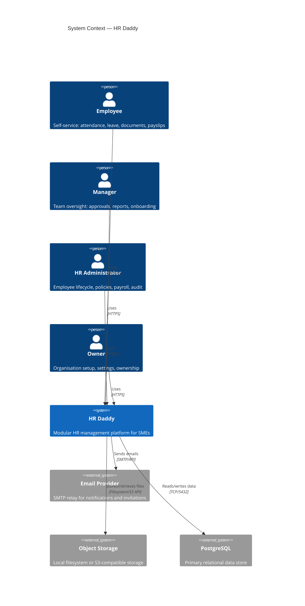

---

## 2. Container Diagram

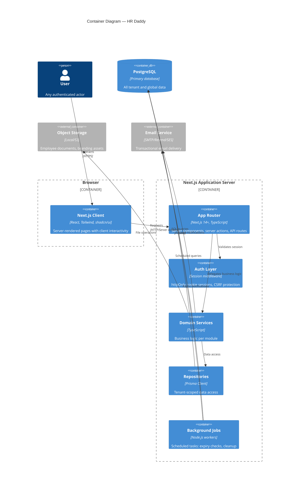

---

## 3. Application Modules

HR Daddy is a modular monolith. Each module encapsulates its own domain logic, services, repositories, and UI routes while sharing infrastructure (auth, DB connection, notification bus).

| Module | Responsibility |
|--------|---------------|
| **Auth** | Registration, login, session, password reset, invitation acceptance |
| **Organisation** | Org CRUD, settings, membership, branding |
| **Employee** | Employee lifecycle, directory, profiles, departments, job titles, reporting |
| **Leave** | Leave types, policies, balances, requests, approvals, calendar |
| **Attendance** | Clock in/out, history, corrections, missing clock-out detection |
| **Onboarding** | Templates, task assignment, completion tracking |
| **Documents** | Categories, upload/download, expiry, visibility |
| **Payroll** | Periods, records, line items, approval, payslip publication |
| **Notifications** | In-app notifications, email dispatch, deduplication |
| **Audit** | Append-only event recording, query interface |

---

## 4. Component Diagrams

### 4.1 Authentication

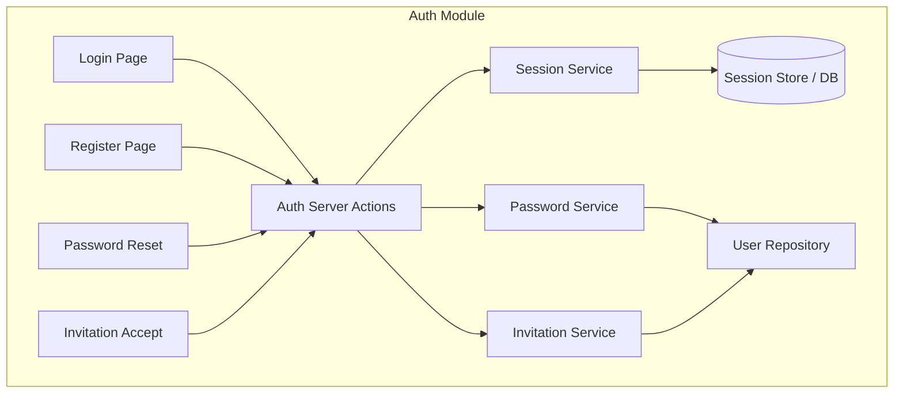

### 4.2 Employee Management

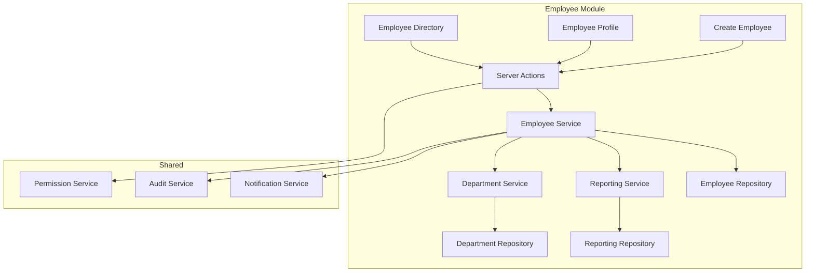

### 4.3 Leave Management

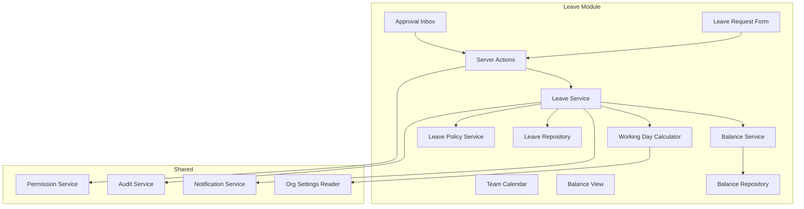

### 4.4 Attendance

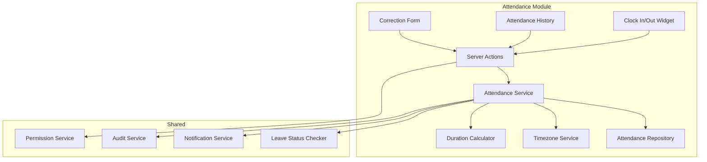

### 4.5 Onboarding

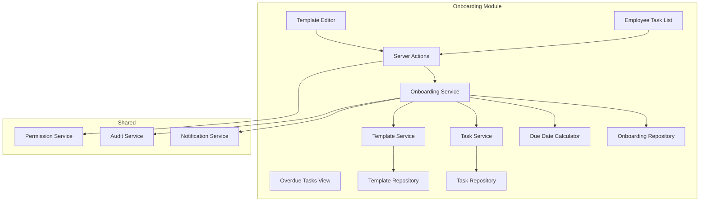

### 4.6 Documents

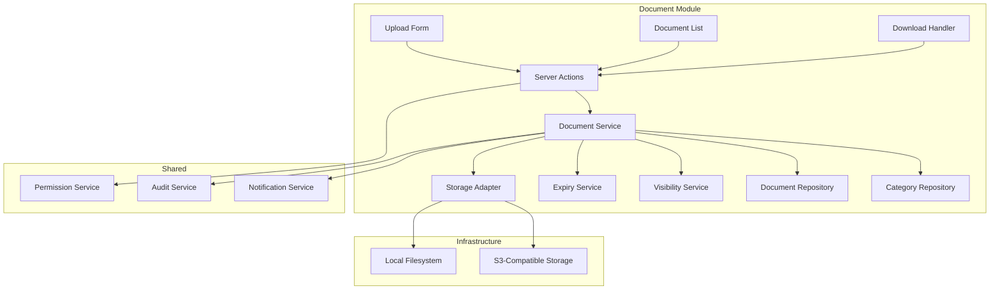

### 4.7 Payroll

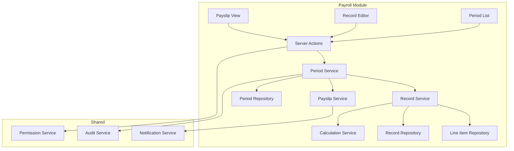

### 4.8 Notifications

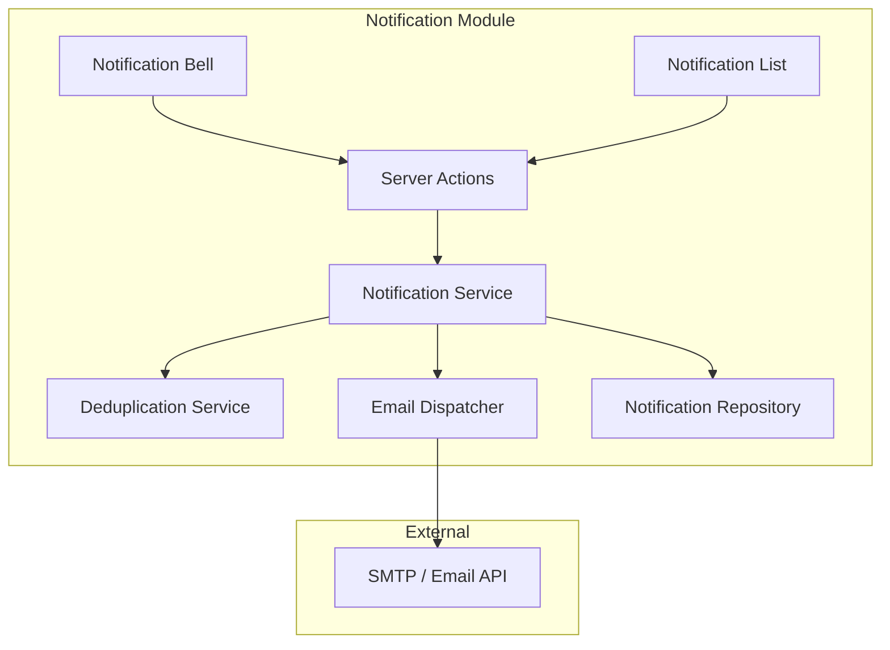

### 4.9 Audit

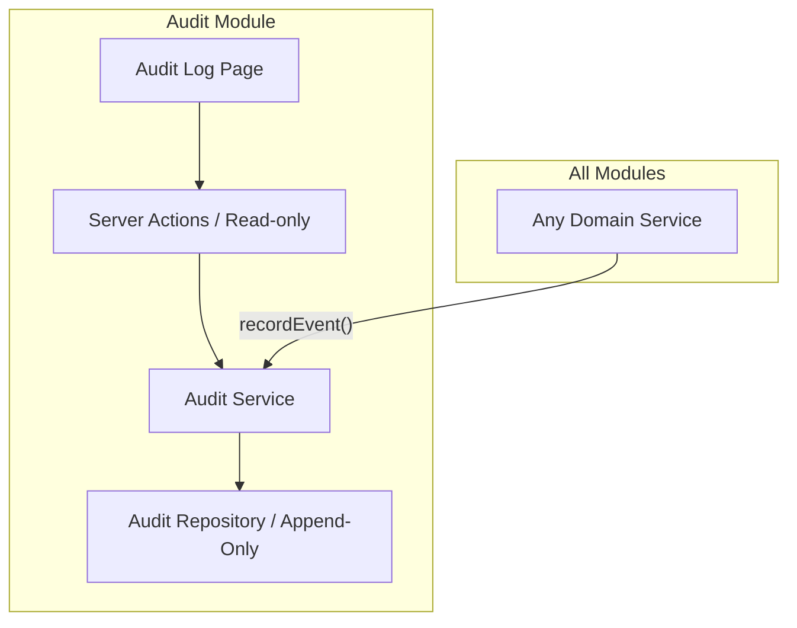

---

## 5. Backend Boundaries

```
src/
├── modules/
│   ├── auth/
│   │   ├── actions/          # Server actions (login, register, reset)
│   │   ├── services/         # SessionService, PasswordService
│   │   └── repositories/     # UserRepository
│   ├── organisation/
│   │   ├── actions/
│   │   ├── services/         # OrgService, MembershipService
│   │   └── repositories/
│   ├── employee/
│   │   ├── actions/
│   │   ├── services/         # EmployeeService, DepartmentService, ReportingService
│   │   └── repositories/
│   ├── leave/
│   │   ├── actions/
│   │   ├── services/         # LeaveService, BalanceService, PolicyService
│   │   └── repositories/
│   ├── attendance/
│   │   ├── actions/
│   │   ├── services/         # AttendanceService, DurationCalculator
│   │   └── repositories/
│   ├── onboarding/
│   │   ├── actions/
│   │   ├── services/         # OnboardingService, TemplateService
│   │   └── repositories/
│   ├── documents/
│   │   ├── actions/
│   │   ├── services/         # DocumentService, ExpiryService
│   │   └── repositories/
│   ├── payroll/
│   │   ├── actions/
│   │   ├── services/         # PeriodService, RecordService, CalcService
│   │   └── repositories/
│   ├── notifications/
│   │   ├── actions/
│   │   ├── services/         # NotificationService, EmailDispatcher
│   │   └── repositories/
│   └── audit/
│       ├── actions/
│       ├── services/         # AuditService (append-only)
│       └── repositories/
├── shared/
│   ├── auth/                 # Session middleware, context resolver
│   ├── permissions/          # PermissionService, role definitions
│   ├── storage/              # StorageAdapter interface + implementations
│   ├── email/                # EmailAdapter interface + implementations
│   ├── errors/               # Typed error hierarchy
│   ├── validation/           # Zod schemas, shared validators
│   └── types/                # Shared TypeScript types
└── infrastructure/
    ├── database/             # Prisma client, tenant-scoped base repo
    ├── jobs/                 # Background job runner
    └── config/               # Environment config loader
```

---

## 6. Frontend Boundaries

```
app/
├── (auth)/                   # Unauthenticated routes
│   ├── login/
│   ├── register/
│   ├── reset-password/
│   └── invite/[token]/
├── (app)/                    # Authenticated routes (layout with nav, org context)
│   ├── dashboard/            # Role-appropriate dashboard
│   ├── employees/            # Directory, profiles, create
│   ├── leave/                # Requests, approvals, calendar
│   ├── attendance/           # Clock widget, history, corrections
│   ├── onboarding/           # Templates, tasks
│   ├── documents/            # Upload, list, categories
│   ├── payroll/              # Periods, records, payslips
│   ├── notifications/        # Notification center
│   ├── audit/                # Audit log viewer
│   └── settings/             # Organisation and personal settings
├── api/                      # API routes (external integrations, webhooks)
│   └── v1/
└── components/               # Shared UI components (shadcn/ui based)
```

---

## 7. Authentication Architecture

- **Strategy:** Session-based with httpOnly secure cookies
- **Session store:** Database-backed (sessions table) for revocability
- **Cookie config:** httpOnly, Secure, SameSite=Lax, path=/
- **CSRF:** Double-submit cookie pattern for mutations
- **Password:** bcrypt with cost factor 12
- **Account lockout:** 5 failed attempts → 15-minute lock (BR-AUTH-004)
- **Session lifetime:** 24 hours idle, 7 days maximum
- **Org context:** Stored in session after org selection; validated on every request

---

## 8. Database Architecture

- **Engine:** PostgreSQL 15+
- **ORM:** Prisma with explicit tenant-scoped queries
- **Migrations:** Prisma Migrate (version-controlled, sequential)
- **Connection:** Single connection pool per application instance
- **Tenant isolation:** `organisation_id` column on all org-owned tables, enforced at repository layer
- **Audit table:** Separate DB role with REVOKE UPDATE/DELETE for immutability
- **Indexes:** Composite indexes on (organisation_id, ...) for all hot-path queries
- **Timestamps:** All stored as UTC (TIMESTAMP WITH TIME ZONE)
- **Monetary values:** Integer cents (no floating-point)

---

## 9. File Storage Architecture

- **Abstraction:** `StorageAdapter` interface with pluggable implementations
- **V1 default:** Local filesystem (Docker volume)
- **Production option:** S3-compatible (AWS S3, MinIO, Backblaze B2)
- **Path format:** `{organisation_id}/{entity_type}/{entity_id}/{filename}`
- **Access control:** Server-generated signed URLs with 5-minute expiry
- **Upload validation:** MIME type verification via magic bytes, 10MB max size
- **Cleanup:** Compensating transaction pattern — delete storage on DB write failure

---

## 10. Notification Architecture

- **In-app:** Synchronous insert into notifications table during request transaction
- **Email:** Asynchronous dispatch via email adapter (fire-and-forget from business logic)
- **Deduplication:** 5-minute window check by (recipient, event_type, event_id)
- **Delivery failure:** Logged but does not fail the originating operation
- **Channels:** In-app (V1), Email (V1), Push/SMS (future)
- **Templates:** Handlebars-based email templates with org branding

---

## 11. Background Jobs

- **Runner:** Simple Node.js cron-based scheduler (node-cron)
- **V1 jobs:**
  - Document expiry check (daily)
  - Missing clock-out detection (hourly)
  - Expired invitation cleanup (daily)
  - Soft-delete permanent removal after retention (daily)
- **Tenant context:** Jobs iterate per-organisation with isolated context
- **Failure handling:** Per-org failure does not block other orgs; errors logged
- **Scaling:** Single worker process in V1; queue-based in future

---

## 12. Audit System

- **Storage:** Append-only PostgreSQL table with restricted DB permissions
- **Write path:** `AuditService.record()` called within domain service transactions
- **Read path:** Paginated query with filters (actor, action, target, date range)
- **Immutability:** No UPDATE/DELETE permissions granted to application DB user
- **Retention:** Indefinite
- **Severity levels:** normal, high (permission changes, payroll), critical (ownership transfer, data deletion)
- **Captured fields:** actor_id, org_id, action, target_type, target_id, before_state, after_state, ip_address, metadata

---

## 13. Testing Architecture

| Level | Tool | Scope |
|-------|------|-------|
| Unit | Vitest | Business rules, calculations, state machines, validators |
| Integration | Vitest + test DB | Repository queries, tenant isolation, service orchestration |
| E2E | Playwright | Full browser workflows, permission enforcement, cross-tenant rejection |

- **Test database:** Separate PostgreSQL instance; truncated between test suites
- **Fixtures:** Factory functions for consistent test data creation
- **Cross-tenant tests:** Every repository/service tested for org isolation
- **CI:** Type check → Lint → Unit → Integration → E2E (fail-fast pipeline)

---

## 14. Deployment Architecture

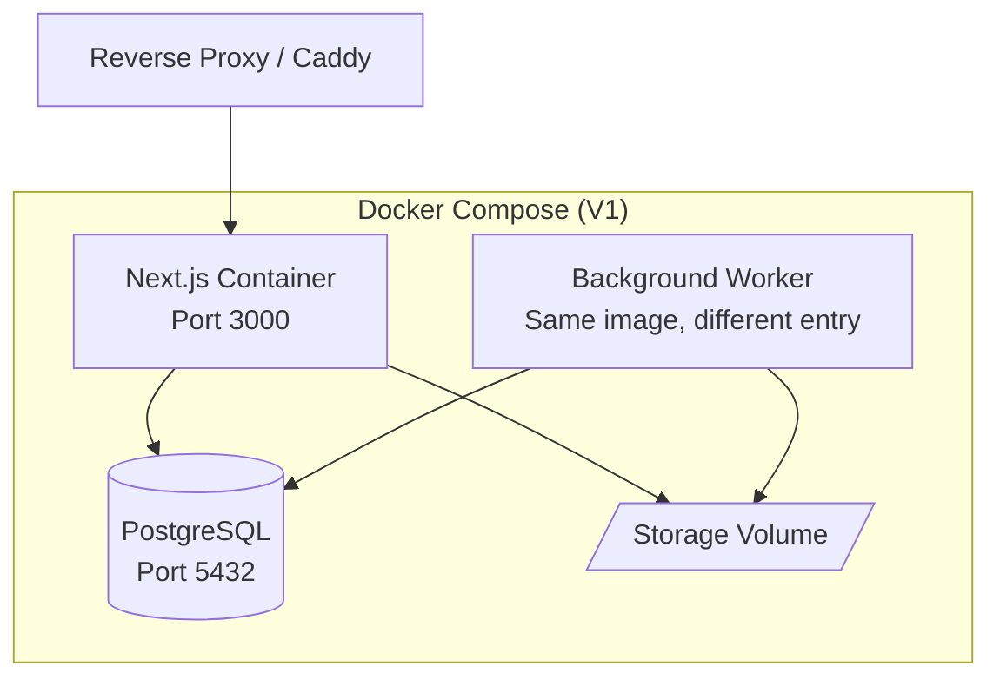

- **V1 model:** Single Docker Compose stack
- **Containers:** Next.js app + PostgreSQL + background worker (optional)
- **Storage:** Docker volume for local file storage
- **Reverse proxy:** Caddy or nginx for TLS termination
- **Environment:** `.env` file with validated config at startup
- **Database migrations:** Run at container startup before accepting traffic
- **Health check:** `/api/health` endpoint verifying DB connectivity

---

## 15. Observability

- **Structured logging:** JSON format with request_id, org_id, user_id, action
- **Log levels:** error, warn, info, debug (configurable via env)
- **Request tracing:** Unique request ID propagated through middleware → services → repositories
- **Metrics (future):** Prometheus-compatible endpoint for request latency, error rate, queue depth
- **Alerting (future):** Error rate thresholds, failed job count, missing clock-out accumulation
- **Health endpoint:** `/api/health` returns DB connectivity and basic app status

---

## Architecture Principles

1. **Modular monolith** — Clear module boundaries without network overhead of microservices
2. **Tenant-first** — Every query, cache key, and file path includes organisation context
3. **Secure by default** — Server-side permission checks on every mutation and sensitive read
4. **Audit everything** — All state-changing operations recorded immutably
5. **Fail safe** — Notification failures don't break business operations
6. **Single source of truth** — Session-derived org context, never client-supplied
7. **Explicit over implicit** — Permission keys, not role-name string comparisons
8. **Testable** — Every layer independently testable with clear dependency boundaries
