# Entity Relationship Diagram

This document contains the complete Mermaid ER diagram for HR Daddy V1, followed by field documentation tables for every entity.

---

## Complete ER Diagram

```mermaid
erDiagram
    User {
        uuid id PK
        string email UK
        string password_hash
        string full_name
        string status
        datetime email_verified_at
        datetime last_login_at
        int failed_login_attempts
        datetime locked_until
        datetime created_at
        datetime updated_at
    }

    Organisation {
        uuid id PK
        string name
        string industry
        string size_range
        string address
        string phone
        string website
        datetime created_at
        datetime updated_at
    }


    OrganisationSettings {
        uuid id PK
        uuid organisation_id FK
        string timezone
        string currency
        jsonb working_days
        time working_hours_start
        time working_hours_end
        string date_format
        int leave_year_start_month
        string logo_url
        string primary_colour
        string display_name
        boolean hr_admin_sensitive_access
        boolean hr_admin_payroll_approve
        boolean hr_admin_audit_export
        boolean hr_admin_document_delete
        datetime created_at
        datetime updated_at
    }

    OrganisationMembership {
        uuid id PK
        uuid user_id FK
        uuid organisation_id FK
        string role
        string status
        datetime last_accessed_at
        datetime revoked_at
        datetime created_at
        datetime updated_at
    }

    Invitation {
        uuid id PK
        uuid organisation_id FK
        string email
        string role
        string token UK
        uuid employee_id FK
        string status
        datetime expires_at
        datetime accepted_at
        uuid invited_by FK
        datetime created_at
    }

    Employee {
        uuid id PK
        uuid organisation_id FK
        uuid user_id FK
        string first_name
        string last_name
        string work_email
        string personal_email
        string phone
        date date_of_birth
        string gender
        string address
        string emergency_contacts
        string employee_number UK
        uuid department_id FK
        uuid job_title_id FK
        uuid work_location_id FK
        uuid employment_type_id FK
        string status
        date start_date
        date probation_end_date
        decimal base_salary
        string pay_frequency
        string bank_details_encrypted
        string national_id_encrypted
        datetime deactivated_at
        datetime reactivated_at
        datetime archived_at
        datetime created_at
        datetime updated_at
        int version
    }


    Department {
        uuid id PK
        uuid organisation_id FK
        string name
        string description
        uuid manager_id FK
        uuid parent_department_id FK
        datetime archived_at
        datetime created_at
        datetime updated_at
    }

    JobTitle {
        uuid id PK
        uuid organisation_id FK
        string name
        string description
        datetime archived_at
        datetime created_at
        datetime updated_at
    }

    WorkLocation {
        uuid id PK
        uuid organisation_id FK
        string name
        string address
        string type
        datetime archived_at
        datetime created_at
        datetime updated_at
    }

    EmploymentType {
        uuid id PK
        uuid organisation_id FK
        string name
        datetime archived_at
        datetime created_at
        datetime updated_at
    }

    ReportingRelationship {
        uuid id PK
        uuid organisation_id FK
        uuid employee_id FK
        uuid manager_id FK
        date effective_from
        date effective_until
        datetime created_at
        datetime updated_at
    }

    AttendanceRecord {
        uuid id PK
        uuid organisation_id FK
        uuid employee_id FK
        datetime clock_in
        datetime clock_out
        int duration_minutes
        string location_type
        string status
        string source
        date session_date
        uuid corrected_by FK
        string correction_reason
        datetime original_clock_in
        datetime original_clock_out
        datetime created_at
        datetime updated_at
    }


    LeaveType {
        uuid id PK
        uuid organisation_id FK
        string name
        string colour_code
        boolean requires_approval
        boolean balance_tracked
        boolean allows_negative_balance
        boolean requires_document
        int document_threshold_days
        datetime archived_at
        datetime created_at
        datetime updated_at
    }

    LeavePolicy {
        uuid id PK
        uuid organisation_id FK
        uuid leave_type_id FK
        uuid employment_type_id FK
        int annual_entitlement_days
        string accrual_method
        int carry_over_limit_days
        boolean pro_rata_enabled
        datetime created_at
        datetime updated_at
    }

    LeaveBalance {
        uuid id PK
        uuid organisation_id FK
        uuid employee_id FK
        uuid leave_type_id FK
        int year
        decimal entitlement
        decimal used
        decimal pending
        decimal carry_over
        datetime created_at
        datetime updated_at
    }

    LeaveRequest {
        uuid id PK
        uuid organisation_id FK
        uuid employee_id FK
        uuid leave_type_id FK
        date start_date
        date end_date
        boolean half_day
        string half_day_period
        decimal working_days
        string status
        string notes
        uuid approver_id FK
        string escalation_reason
        datetime created_at
        datetime updated_at
        int version
    }

    LeaveApproval {
        uuid id PK
        uuid leave_request_id FK
        uuid approver_id FK
        string decision
        string reason
        boolean is_override
        datetime decided_at
        datetime created_at
    }

    HolidayCalendar {
        uuid id PK
        uuid organisation_id FK
        string name
        int year
        datetime created_at
        datetime updated_at
    }

    Holiday {
        uuid id PK
        uuid holiday_calendar_id FK
        uuid organisation_id FK
        string name
        date date
        boolean recurring
        datetime created_at
    }


    OnboardingTemplate {
        uuid id PK
        uuid organisation_id FK
        string name
        string description
        datetime archived_at
        datetime created_at
        datetime updated_at
    }

    OnboardingTemplateTask {
        uuid id PK
        uuid template_id FK
        string title
        string description
        string assignee_role
        int relative_due_day
        int sort_order
        datetime created_at
        datetime updated_at
    }

    EmployeeOnboarding {
        uuid id PK
        uuid organisation_id FK
        uuid employee_id FK
        uuid template_id FK
        string status
        date start_date
        datetime completed_at
        datetime cancelled_at
        string cancellation_reason
        datetime created_at
        datetime updated_at
    }

    EmployeeOnboardingTask {
        uuid id PK
        uuid onboarding_id FK
        uuid employee_id FK
        string title
        string description
        string assignee_role
        uuid assignee_id FK
        date due_date
        string status
        string notes
        uuid completed_by FK
        datetime completed_at
        datetime created_at
        datetime updated_at
    }

    DocumentCategory {
        uuid id PK
        uuid organisation_id FK
        string name
        string description
        string sensitivity_level
        string default_visibility
        int retention_days
        datetime archived_at
        datetime created_at
        datetime updated_at
    }

    EmployeeDocument {
        uuid id PK
        uuid organisation_id FK
        uuid employee_id FK
        uuid category_id FK
        string filename
        string storage_path
        string mime_type
        int file_size_bytes
        string description
        date expiry_date
        string status
        uuid uploaded_by FK
        datetime archived_at
        datetime deleted_at
        datetime created_at
        datetime updated_at
    }


    PayrollPeriod {
        uuid id PK
        uuid organisation_id FK
        string label
        date start_date
        date end_date
        string status
        uuid prepared_by FK
        uuid approved_by FK
        datetime approved_at
        datetime published_at
        datetime paid_at
        string reopen_reason
        datetime created_at
        datetime updated_at
        int version
    }

    PayrollRecord {
        uuid id PK
        uuid payroll_period_id FK
        uuid organisation_id FK
        uuid employee_id FK
        int gross_pay_cents
        int total_deductions_cents
        int net_pay_cents
        string currency
        string notes
        datetime created_at
        datetime updated_at
        int version
    }

    PayrollLineItem {
        uuid id PK
        uuid payroll_record_id FK
        string category
        string type
        string description
        int amount_cents
        int sort_order
        datetime created_at
    }

    Notification {
        uuid id PK
        uuid organisation_id FK
        uuid recipient_id FK
        string type
        string title
        string body
        string link
        boolean is_read
        datetime read_at
        string source_event_type
        uuid source_event_id
        datetime created_at
    }

    AuditLog {
        uuid id PK
        uuid organisation_id FK
        uuid actor_id FK
        string action
        string target_type
        uuid target_id
        jsonb before_state
        jsonb after_state
        jsonb metadata
        string ip_address
        string severity
        datetime created_at
    }


    %% Relationships
    User ||--o{ OrganisationMembership : "has memberships"
    Organisation ||--o{ OrganisationMembership : "has members"
    Organisation ||--|| OrganisationSettings : "has settings"
    Organisation ||--o{ Invitation : "has invitations"
    Organisation ||--o{ Employee : "employs"
    Organisation ||--o{ Department : "has departments"
    Organisation ||--o{ JobTitle : "defines titles"
    Organisation ||--o{ WorkLocation : "has locations"
    Organisation ||--o{ EmploymentType : "defines types"
    Organisation ||--o{ LeaveType : "configures leave"
    Organisation ||--o{ LeavePolicy : "sets policies"
    Organisation ||--o{ HolidayCalendar : "has calendars"
    Organisation ||--o{ OnboardingTemplate : "has templates"
    Organisation ||--o{ DocumentCategory : "has categories"
    Organisation ||--o{ PayrollPeriod : "runs payroll"
    Organisation ||--o{ Notification : "scopes notifications"
    Organisation ||--o{ AuditLog : "records audit"

    User ||--o{ Employee : "linked as"
    Employee ||--o{ ReportingRelationship : "reports in"
    Employee ||--o{ AttendanceRecord : "records attendance"
    Employee ||--o{ LeaveBalance : "has balances"
    Employee ||--o{ LeaveRequest : "submits leave"
    Employee ||--o{ EmployeeOnboarding : "undergoes onboarding"
    Employee ||--o{ EmployeeDocument : "owns documents"
    Employee ||--o{ PayrollRecord : "has payroll"

    Department ||--o{ Employee : "contains"
    Department ||--o| Employee : "managed by"
    Department ||--o{ Department : "has children"
    JobTitle ||--o{ Employee : "assigned to"
    WorkLocation ||--o{ Employee : "located at"
    EmploymentType ||--o{ Employee : "classified as"
    EmploymentType ||--o{ LeavePolicy : "scopes policy"

    LeaveType ||--o{ LeavePolicy : "governed by"
    LeaveType ||--o{ LeaveBalance : "tracks balance"
    LeaveType ||--o{ LeaveRequest : "categorises"
    LeaveRequest ||--|| LeaveApproval : "has decision"
    HolidayCalendar ||--o{ Holiday : "contains"

    OnboardingTemplate ||--o{ OnboardingTemplateTask : "defines tasks"
    OnboardingTemplate ||--o{ EmployeeOnboarding : "instantiated as"
    EmployeeOnboarding ||--o{ EmployeeOnboardingTask : "generates tasks"

    DocumentCategory ||--o{ EmployeeDocument : "categorises"
    PayrollPeriod ||--o{ PayrollRecord : "contains records"
    PayrollRecord ||--o{ PayrollLineItem : "has line items"

    User ||--o{ Notification : "receives"
    User ||--o{ AuditLog : "performed by"
```

---

## Relationship Summary

| From | To | Cardinality | Description |
|------|-----|-------------|-------------|
| User | OrganisationMembership | 1:N | A user can belong to multiple orgs |
| Organisation | OrganisationMembership | 1:N | An org has multiple members |
| Organisation | OrganisationSettings | 1:1 | Each org has exactly one settings record |
| Organisation | Employee | 1:N | An org employs many people |
| User | Employee | 1:N | A user can be an employee in multiple orgs |
| Employee | Department | N:1 | Employee optionally belongs to one department |
| Employee | JobTitle | N:1 | Employee has one job title |
| Employee | WorkLocation | N:1 | Employee assigned to one location |
| Employee | EmploymentType | N:1 | Employee has one employment type |
| Employee | ReportingRelationship | 1:1 (as report) | Employee has zero or one manager |
| Employee | LeaveRequest | 1:N | Employee submits many leave requests |
| Employee | LeaveBalance | 1:N | One balance per leave type per year |
| Employee | AttendanceRecord | 1:N | Many attendance records over time |
| Employee | EmployeeOnboarding | 1:N | Can have multiple onboarding instances (not concurrent) |
| Employee | EmployeeDocument | 1:N | Employee has many documents |
| Employee | PayrollRecord | 1:N | One record per payroll period |
| LeaveRequest | LeaveApproval | 1:1 | Each request has one approval decision |
| PayrollPeriod | PayrollRecord | 1:N | Period contains records for all employees |
| PayrollRecord | PayrollLineItem | 1:N | Record has many line items |
| OnboardingTemplate | OnboardingTemplateTask | 1:N | Template has many task definitions |
| EmployeeOnboarding | EmployeeOnboardingTask | 1:N | Instance has many concrete tasks |
| HolidayCalendar | Holiday | 1:N | Calendar contains many holidays |
| DocumentCategory | EmployeeDocument | 1:N | Category groups many documents |

---

## Field Documentation Tables

### User

| Field | Type | Constraints | Description |
|-------|------|-------------|-------------|
| id | UUID | PK | Unique user identifier |
| email | VARCHAR(255) | UNIQUE, NOT NULL | Login email address |
| password_hash | VARCHAR(255) | NOT NULL | Bcrypt-hashed password |
| full_name | VARCHAR(200) | NOT NULL | Display name |
| status | VARCHAR(20) | NOT NULL | unverified, verified, disabled |
| email_verified_at | TIMESTAMP | NULL | When email was verified |
| last_login_at | TIMESTAMP | NULL | Most recent login |
| failed_login_attempts | INT | DEFAULT 0 | Consecutive failed logins (resets on success) |
| locked_until | TIMESTAMP | NULL | Account lockout expiry (BR-AUTH-004) |
| created_at | TIMESTAMP | NOT NULL, DEFAULT NOW | Record creation |
| updated_at | TIMESTAMP | NOT NULL | Last modification |

**Indexes:** email (unique), status
**Soft-delete:** No (accounts are disabled, not deleted)
**Sensitive data:** password_hash (never exposed), email
**Global entity:** Yes (not tenant-scoped)

---

### Organisation

| Field | Type | Constraints | Description |
|-------|------|-------------|-------------|
| id | UUID | PK | Unique org / tenant identifier |
| name | VARCHAR(100) | NOT NULL | Organisation display name |
| industry | VARCHAR(100) | NULL | Industry classification |
| size_range | VARCHAR(50) | NULL | e.g., "1-10", "11-50", "51-200" |
| address | TEXT | NULL | Registered address |
| phone | VARCHAR(50) | NULL | Contact phone |
| website | VARCHAR(255) | NULL | Organisation website URL |
| created_at | TIMESTAMP | NOT NULL | Creation timestamp |
| updated_at | TIMESTAMP | NOT NULL | Last update |

**Indexes:** name
**Soft-delete:** No in V1 (future: archived_at)
**Sensitive data:** None
**Global entity:** Yes (is the tenant boundary itself)

---

### OrganisationSettings

| Field | Type | Constraints | Description |
|-------|------|-------------|-------------|
| id | UUID | PK | Settings record identifier |
| organisation_id | UUID | FK, UNIQUE, NOT NULL | Parent organisation |
| timezone | VARCHAR(50) | NOT NULL, DEFAULT 'UTC' | IANA timezone identifier |
| currency | VARCHAR(3) | NOT NULL, DEFAULT 'USD' | ISO 4217 currency code |
| working_days | JSONB | NOT NULL | Array of working day numbers [1-7] |
| working_hours_start | TIME | NOT NULL, DEFAULT '09:00' | Day start time |
| working_hours_end | TIME | NOT NULL, DEFAULT '17:00' | Day end time |
| date_format | VARCHAR(20) | NOT NULL, DEFAULT 'DD/MM/YYYY' | Display date format |
| leave_year_start_month | INT | NOT NULL, DEFAULT 1 | Month (1-12) leave year begins |
| logo_url | VARCHAR(500) | NULL | Branding logo storage URL |
| primary_colour | VARCHAR(7) | NULL | Hex colour code for branding |
| display_name | VARCHAR(100) | NULL | Custom display name (if different from org name) |
| hr_admin_sensitive_access | BOOLEAN | NOT NULL, DEFAULT TRUE | HR can view national ID / bank |
| hr_admin_payroll_approve | BOOLEAN | NOT NULL, DEFAULT TRUE | HR can approve payroll |
| hr_admin_audit_export | BOOLEAN | NOT NULL, DEFAULT TRUE | HR can export audit logs |
| hr_admin_document_delete | BOOLEAN | NOT NULL, DEFAULT TRUE | HR can delete archived docs |
| created_at | TIMESTAMP | NOT NULL | Creation |
| updated_at | TIMESTAMP | NOT NULL | Last update |

**Indexes:** organisation_id (unique)
**Soft-delete:** N/A (1:1 with org)
**Sensitive data:** None
**Organisation-owned:** Yes

---

### OrganisationMembership

| Field | Type | Constraints | Description |
|-------|------|-------------|-------------|
| id | UUID | PK | Membership record identifier |
| user_id | UUID | FK (User), NOT NULL | The user account |
| organisation_id | UUID | FK (Organisation), NOT NULL | The organisation |
| role | VARCHAR(30) | NOT NULL | owner, hr_admin, manager, employee |
| status | VARCHAR(20) | NOT NULL | active, revoked |
| last_accessed_at | TIMESTAMP | NULL | Last org context access |
| revoked_at | TIMESTAMP | NULL | When access was revoked |
| created_at | TIMESTAMP | NOT NULL | Membership creation |
| updated_at | TIMESTAMP | NOT NULL | Last update |

**Indexes:** (user_id, organisation_id) UNIQUE, organisation_id, user_id, status
**Soft-delete:** status = 'revoked' with revoked_at timestamp
**Sensitive data:** None
**Organisation-owned:** Yes

---

### Invitation

| Field | Type | Constraints | Description |
|-------|------|-------------|-------------|
| id | UUID | PK | Invitation identifier |
| organisation_id | UUID | FK, NOT NULL | Target organisation |
| email | VARCHAR(255) | NOT NULL | Invitee email |
| role | VARCHAR(30) | NOT NULL | Role to assign on acceptance |
| token | VARCHAR(64) | UNIQUE, NOT NULL | Cryptographic invitation token |
| employee_id | UUID | FK, NULL | Pre-linked employee record (if inviting existing employee) |
| status | VARCHAR(20) | NOT NULL | pending, accepted, expired, revoked |
| expires_at | TIMESTAMP | NOT NULL | 7 days after creation |
| accepted_at | TIMESTAMP | NULL | When accepted |
| invited_by | UUID | FK (User), NOT NULL | Who sent the invitation |
| created_at | TIMESTAMP | NOT NULL | Creation timestamp |

**Indexes:** token (unique), (organisation_id, email), status
**Soft-delete:** N/A (status-based lifecycle)
**Sensitive data:** token (single-use secret)
**Organisation-owned:** Yes

---

### Employee

| Field | Type | Constraints | Description |
|-------|------|-------------|-------------|
| id | UUID | PK | Employee record identifier |
| organisation_id | UUID | FK, NOT NULL | Tenant ownership |
| user_id | UUID | FK (User), NULL | Linked login account (nullable per BR-EMP-001) |
| first_name | VARCHAR(100) | NOT NULL | Legal first name |
| last_name | VARCHAR(100) | NOT NULL | Legal last name |
| work_email | VARCHAR(255) | NOT NULL | Work email (unique per org) |
| personal_email | VARCHAR(255) | NULL | Personal contact email |
| phone | VARCHAR(50) | NULL | Contact phone |
| date_of_birth | DATE | NULL | Date of birth |
| gender | VARCHAR(20) | NULL | Gender identity |
| address | TEXT | NULL | Home address |
| emergency_contacts | JSONB | NULL | Array of emergency contact objects |
| employee_number | VARCHAR(50) | NULL | Org-assigned employee number |
| department_id | UUID | FK (Department), NULL | Current department (nullable per BR-EMP-007) |
| job_title_id | UUID | FK (JobTitle), NULL | Current job title |
| work_location_id | UUID | FK (WorkLocation), NULL | Assigned location |
| employment_type_id | UUID | FK (EmploymentType), NULL | Full-time, Part-time, etc. |
| status | VARCHAR(20) | NOT NULL | draft, invited, active, suspended, deactivated, archived |
| start_date | DATE | NULL | Employment start date |
| probation_end_date | DATE | NULL | Probation period end |
| base_salary | INT | NULL | Base salary in cents (decimal-safe) |
| pay_frequency | VARCHAR(20) | NULL | monthly, bi-weekly, weekly |
| bank_details_encrypted | TEXT | NULL | Encrypted bank account info |
| national_id_encrypted | TEXT | NULL | Encrypted national/tax ID |
| deactivated_at | TIMESTAMP | NULL | When deactivated |
| reactivated_at | TIMESTAMP | NULL | When last reactivated |
| archived_at | TIMESTAMP | NULL | When archived |
| created_at | TIMESTAMP | NOT NULL | Record creation |
| updated_at | TIMESTAMP | NOT NULL | Last modification |
| version | INT | NOT NULL, DEFAULT 1 | Optimistic lock version |

**Indexes:** (organisation_id, work_email) UNIQUE, (organisation_id, employee_number) UNIQUE WHERE employee_number IS NOT NULL, organisation_id, user_id, status, department_id
**Soft-delete:** status = 'archived' with archived_at
**Sensitive data:** base_salary, bank_details_encrypted, national_id_encrypted, date_of_birth, address
**Organisation-owned:** Yes

---

### Department

| Field | Type | Constraints | Description |
|-------|------|-------------|-------------|
| id | UUID | PK | Department identifier |
| organisation_id | UUID | FK, NOT NULL | Tenant ownership |
| name | VARCHAR(100) | NOT NULL | Department name |
| description | TEXT | NULL | Department description |
| manager_id | UUID | FK (Employee), NULL | Designated department head |
| parent_department_id | UUID | FK (Department), NULL | Parent for hierarchy |
| archived_at | TIMESTAMP | NULL | Soft-archive timestamp |
| created_at | TIMESTAMP | NOT NULL | Creation |
| updated_at | TIMESTAMP | NOT NULL | Last update |

**Indexes:** (organisation_id, name) UNIQUE WHERE archived_at IS NULL, organisation_id, manager_id
**Soft-delete:** archived_at timestamp
**Sensitive data:** None
**Organisation-owned:** Yes

---

### JobTitle

| Field | Type | Constraints | Description |
|-------|------|-------------|-------------|
| id | UUID | PK | Job title identifier |
| organisation_id | UUID | FK, NOT NULL | Tenant ownership |
| name | VARCHAR(100) | NOT NULL | Title name (e.g., "Software Engineer") |
| description | TEXT | NULL | Title description |
| archived_at | TIMESTAMP | NULL | Soft-archive |
| created_at | TIMESTAMP | NOT NULL | Creation |
| updated_at | TIMESTAMP | NOT NULL | Last update |

**Indexes:** (organisation_id, name) UNIQUE WHERE archived_at IS NULL
**Soft-delete:** archived_at
**Sensitive data:** None
**Organisation-owned:** Yes

---

### WorkLocation

| Field | Type | Constraints | Description |
|-------|------|-------------|-------------|
| id | UUID | PK | Location identifier |
| organisation_id | UUID | FK, NOT NULL | Tenant ownership |
| name | VARCHAR(100) | NOT NULL | Location name |
| address | TEXT | NULL | Physical address |
| type | VARCHAR(20) | NOT NULL | office, remote, hybrid |
| archived_at | TIMESTAMP | NULL | Soft-archive |
| created_at | TIMESTAMP | NOT NULL | Creation |
| updated_at | TIMESTAMP | NOT NULL | Last update |

**Indexes:** (organisation_id, name) UNIQUE WHERE archived_at IS NULL
**Soft-delete:** archived_at
**Sensitive data:** None
**Organisation-owned:** Yes

---

### EmploymentType

| Field | Type | Constraints | Description |
|-------|------|-------------|-------------|
| id | UUID | PK | Employment type identifier |
| organisation_id | UUID | FK, NOT NULL | Tenant ownership |
| name | VARCHAR(50) | NOT NULL | e.g., "Full-time", "Part-time", "Contract" |
| archived_at | TIMESTAMP | NULL | Soft-archive |
| created_at | TIMESTAMP | NOT NULL | Creation |
| updated_at | TIMESTAMP | NOT NULL | Last update |

**Indexes:** (organisation_id, name) UNIQUE WHERE archived_at IS NULL
**Soft-delete:** archived_at
**Sensitive data:** None
**Organisation-owned:** Yes

---

### ReportingRelationship

| Field | Type | Constraints | Description |
|-------|------|-------------|-------------|
| id | UUID | PK | Relationship identifier |
| organisation_id | UUID | FK, NOT NULL | Tenant ownership |
| employee_id | UUID | FK (Employee), NOT NULL | The reporting employee |
| manager_id | UUID | FK (Employee), NOT NULL | The manager |
| effective_from | DATE | NOT NULL | When relationship started |
| effective_until | DATE | NULL | When ended (NULL = current) |
| created_at | TIMESTAMP | NOT NULL | Creation |
| updated_at | TIMESTAMP | NOT NULL | Last update |

**Indexes:** (organisation_id, employee_id) UNIQUE WHERE effective_until IS NULL, manager_id
**Soft-delete:** effective_until set to end date
**Sensitive data:** None
**Organisation-owned:** Yes
**Constraint:** employee_id != manager_id (no self-reporting)

---

### AttendanceRecord

| Field | Type | Constraints | Description |
|-------|------|-------------|-------------|
| id | UUID | PK | Attendance record identifier |
| organisation_id | UUID | FK, NOT NULL | Tenant ownership |
| employee_id | UUID | FK (Employee), NOT NULL | Attending employee |
| clock_in | TIMESTAMP | NOT NULL | Clock-in time (UTC) |
| clock_out | TIMESTAMP | NULL | Clock-out time (UTC, null while open) |
| duration_minutes | INT | NULL | Calculated duration (set on clock-out) |
| location_type | VARCHAR(20) | NOT NULL, DEFAULT 'office' | office, remote |
| status | VARCHAR(30) | NOT NULL | open, closed, missing_clock_out, corrected |
| source | VARCHAR(20) | NOT NULL, DEFAULT 'self' | self, manual, system |
| session_date | DATE | NOT NULL | Date session belongs to (clock-in date) |
| corrected_by | UUID | FK (User), NULL | HR user who made correction |
| correction_reason | TEXT | NULL | Mandatory if corrected |
| original_clock_in | TIMESTAMP | NULL | Pre-correction clock-in |
| original_clock_out | TIMESTAMP | NULL | Pre-correction clock-out |
| created_at | TIMESTAMP | NOT NULL | Creation |
| updated_at | TIMESTAMP | NOT NULL | Last update |

**Indexes:** (organisation_id, employee_id, session_date), (employee_id, status) WHERE status = 'open', organisation_id
**Soft-delete:** No (records are historical)
**Sensitive data:** None
**Organisation-owned:** Yes
**Constraint:** Only one record with status='open' per employee

---

### LeaveType

| Field | Type | Constraints | Description |
|-------|------|-------------|-------------|
| id | UUID | PK | Leave type identifier |
| organisation_id | UUID | FK, NOT NULL | Tenant ownership |
| name | VARCHAR(100) | NOT NULL | e.g., "Annual Leave", "Sick Leave" |
| colour_code | VARCHAR(7) | NULL | Hex colour for calendar display |
| requires_approval | BOOLEAN | NOT NULL, DEFAULT TRUE | Whether manager approval needed |
| balance_tracked | BOOLEAN | NOT NULL, DEFAULT TRUE | Whether balance is deducted |
| allows_negative_balance | BOOLEAN | NOT NULL, DEFAULT FALSE | Can go below zero |
| requires_document | BOOLEAN | NOT NULL, DEFAULT FALSE | Document required |
| document_threshold_days | INT | NULL | Days after which document required |
| archived_at | TIMESTAMP | NULL | Soft-archive |
| created_at | TIMESTAMP | NOT NULL | Creation |
| updated_at | TIMESTAMP | NOT NULL | Last update |

**Indexes:** (organisation_id, name) UNIQUE WHERE archived_at IS NULL
**Soft-delete:** archived_at
**Sensitive data:** None
**Organisation-owned:** Yes

---

### LeavePolicy

| Field | Type | Constraints | Description |
|-------|------|-------------|-------------|
| id | UUID | PK | Policy identifier |
| organisation_id | UUID | FK, NOT NULL | Tenant ownership |
| leave_type_id | UUID | FK (LeaveType), NOT NULL | Applicable leave type |
| employment_type_id | UUID | FK (EmploymentType), NULL | Scoped to employment type (NULL = all) |
| annual_entitlement_days | INT | NOT NULL | Days granted per year (in tenths for decimals) |
| accrual_method | VARCHAR(20) | NOT NULL | annual, monthly, none |
| carry_over_limit_days | INT | NOT NULL, DEFAULT 0 | Max carry-over from previous year |
| pro_rata_enabled | BOOLEAN | NOT NULL, DEFAULT TRUE | Pro-rate for mid-year joiners |
| created_at | TIMESTAMP | NOT NULL | Creation |
| updated_at | TIMESTAMP | NOT NULL | Last update |

**Indexes:** (organisation_id, leave_type_id, employment_type_id) UNIQUE
**Soft-delete:** No
**Sensitive data:** None
**Organisation-owned:** Yes

---

### LeaveBalance

| Field | Type | Constraints | Description |
|-------|------|-------------|-------------|
| id | UUID | PK | Balance record identifier |
| organisation_id | UUID | FK, NOT NULL | Tenant ownership |
| employee_id | UUID | FK (Employee), NOT NULL | Balance owner |
| leave_type_id | UUID | FK (LeaveType), NOT NULL | Leave type |
| year | INT | NOT NULL | Leave year this balance applies to |
| entitlement | DECIMAL(5,1) | NOT NULL | Total granted (e.g., 20.0) |
| used | DECIMAL(5,1) | NOT NULL, DEFAULT 0 | Confirmed used |
| pending | DECIMAL(5,1) | NOT NULL, DEFAULT 0 | Reserved for pending requests |
| carry_over | DECIMAL(5,1) | NOT NULL, DEFAULT 0 | Carried from previous year |
| created_at | TIMESTAMP | NOT NULL | Creation |
| updated_at | TIMESTAMP | NOT NULL | Last update |

**Indexes:** (organisation_id, employee_id, leave_type_id, year) UNIQUE
**Soft-delete:** No
**Sensitive data:** None
**Organisation-owned:** Yes

---

### LeaveRequest

| Field | Type | Constraints | Description |
|-------|------|-------------|-------------|
| id | UUID | PK | Request identifier |
| organisation_id | UUID | FK, NOT NULL | Tenant ownership |
| employee_id | UUID | FK (Employee), NOT NULL | Requesting employee |
| leave_type_id | UUID | FK (LeaveType), NOT NULL | Type of leave |
| start_date | DATE | NOT NULL | Leave start date |
| end_date | DATE | NOT NULL | Leave end date |
| half_day | BOOLEAN | NOT NULL, DEFAULT FALSE | Is this a half-day request |
| half_day_period | VARCHAR(10) | NULL | morning, afternoon (if half_day) |
| working_days | DECIMAL(4,1) | NOT NULL | Calculated working days to deduct |
| status | VARCHAR(20) | NOT NULL | pending, approved, rejected, cancelled, withdrawn |
| notes | TEXT | NULL | Employee notes/reason |
| approver_id | UUID | FK (Employee), NULL | Assigned approver |
| escalation_reason | VARCHAR(100) | NULL | Why escalated (e.g., "manager_unavailable") |
| created_at | TIMESTAMP | NOT NULL | Submission time |
| updated_at | TIMESTAMP | NOT NULL | Last status change |
| version | INT | NOT NULL, DEFAULT 1 | Optimistic lock |

**Indexes:** (organisation_id, employee_id, status), (organisation_id, approver_id, status) WHERE status = 'pending', (employee_id, start_date, end_date)
**Soft-delete:** No (status-based lifecycle)
**Sensitive data:** None
**Organisation-owned:** Yes

---

### LeaveApproval

| Field | Type | Constraints | Description |
|-------|------|-------------|-------------|
| id | UUID | PK | Approval record identifier |
| leave_request_id | UUID | FK (LeaveRequest), UNIQUE, NOT NULL | The request being decided |
| approver_id | UUID | FK (Employee), NOT NULL | Who made the decision |
| decision | VARCHAR(20) | NOT NULL | approved, rejected |
| reason | TEXT | NULL | Required for rejection, optional for approval |
| is_override | BOOLEAN | NOT NULL, DEFAULT FALSE | Whether this was an HR override |
| decided_at | TIMESTAMP | NOT NULL | Decision timestamp |
| created_at | TIMESTAMP | NOT NULL | Record creation |

**Indexes:** leave_request_id (unique), approver_id
**Soft-delete:** No (immutable decision record)
**Sensitive data:** None
**Organisation-owned:** Via leave_request

---

### HolidayCalendar

| Field | Type | Constraints | Description |
|-------|------|-------------|-------------|
| id | UUID | PK | Calendar identifier |
| organisation_id | UUID | FK, NOT NULL | Tenant ownership |
| name | VARCHAR(100) | NOT NULL | e.g., "Singapore Public Holidays 2024" |
| year | INT | NOT NULL | Calendar year |
| created_at | TIMESTAMP | NOT NULL | Creation |
| updated_at | TIMESTAMP | NOT NULL | Last update |

**Indexes:** (organisation_id, year) UNIQUE
**Soft-delete:** No
**Sensitive data:** None
**Organisation-owned:** Yes

---

### Holiday

| Field | Type | Constraints | Description |
|-------|------|-------------|-------------|
| id | UUID | PK | Holiday entry identifier |
| holiday_calendar_id | UUID | FK (HolidayCalendar), NOT NULL | Parent calendar |
| organisation_id | UUID | FK, NOT NULL | Tenant ownership (denormalized for query efficiency) |
| name | VARCHAR(100) | NOT NULL | Holiday name (e.g., "National Day") |
| date | DATE | NOT NULL | Holiday date |
| recurring | BOOLEAN | NOT NULL, DEFAULT FALSE | Whether it recurs annually |
| created_at | TIMESTAMP | NOT NULL | Creation |

**Indexes:** (organisation_id, date), holiday_calendar_id
**Soft-delete:** No (delete directly; holidays are reference data)
**Sensitive data:** None
**Organisation-owned:** Yes

---

### OnboardingTemplate

| Field | Type | Constraints | Description |
|-------|------|-------------|-------------|
| id | UUID | PK | Template identifier |
| organisation_id | UUID | FK, NOT NULL | Tenant ownership |
| name | VARCHAR(100) | NOT NULL | Template name |
| description | TEXT | NULL | Template description |
| archived_at | TIMESTAMP | NULL | Soft-archive |
| created_at | TIMESTAMP | NOT NULL | Creation |
| updated_at | TIMESTAMP | NOT NULL | Last update |

**Indexes:** (organisation_id, name) UNIQUE WHERE archived_at IS NULL
**Soft-delete:** archived_at
**Sensitive data:** None
**Organisation-owned:** Yes

---

### OnboardingTemplateTask

| Field | Type | Constraints | Description |
|-------|------|-------------|-------------|
| id | UUID | PK | Template task identifier |
| template_id | UUID | FK (OnboardingTemplate), NOT NULL | Parent template |
| title | VARCHAR(200) | NOT NULL | Task title |
| description | TEXT | NULL | Detailed task description |
| assignee_role | VARCHAR(20) | NOT NULL | employee, manager, hr |
| relative_due_day | INT | NOT NULL | Days from employee start (e.g., 1, 7, 30) |
| sort_order | INT | NOT NULL | Display order |
| created_at | TIMESTAMP | NOT NULL | Creation |
| updated_at | TIMESTAMP | NOT NULL | Last update |

**Indexes:** (template_id, sort_order)
**Soft-delete:** No (deleted when removed from template)
**Sensitive data:** None
**Organisation-owned:** Via template

---

### EmployeeOnboarding

| Field | Type | Constraints | Description |
|-------|------|-------------|-------------|
| id | UUID | PK | Onboarding instance identifier |
| organisation_id | UUID | FK, NOT NULL | Tenant ownership |
| employee_id | UUID | FK (Employee), NOT NULL | Employee being onboarded |
| template_id | UUID | FK (OnboardingTemplate), NOT NULL | Source template (reference only) |
| status | VARCHAR(20) | NOT NULL | not_started, in_progress, completed, cancelled |
| start_date | DATE | NOT NULL | Employee's joining date (for due date calc) |
| completed_at | TIMESTAMP | NULL | When all tasks completed |
| cancelled_at | TIMESTAMP | NULL | When cancelled |
| cancellation_reason | TEXT | NULL | Why cancelled |
| created_at | TIMESTAMP | NOT NULL | Creation |
| updated_at | TIMESTAMP | NOT NULL | Last update |

**Indexes:** (organisation_id, employee_id, status) WHERE status IN ('not_started', 'in_progress'), employee_id
**Soft-delete:** No (status-based lifecycle)
**Sensitive data:** None
**Organisation-owned:** Yes
**Constraint:** Max one active onboarding per employee (BR-ONB-006)

---

### EmployeeOnboardingTask

| Field | Type | Constraints | Description |
|-------|------|-------------|-------------|
| id | UUID | PK | Task instance identifier |
| onboarding_id | UUID | FK (EmployeeOnboarding), NOT NULL | Parent onboarding instance |
| employee_id | UUID | FK (Employee), NOT NULL | Employee being onboarded (denormalized) |
| title | VARCHAR(200) | NOT NULL | Task title (copied from template) |
| description | TEXT | NULL | Task description (copied from template) |
| assignee_role | VARCHAR(20) | NOT NULL | employee, manager, hr |
| assignee_id | UUID | FK (User), NULL | Resolved specific assignee |
| due_date | DATE | NOT NULL | Calculated due date |
| status | VARCHAR(20) | NOT NULL | pending, in_progress, completed, cancelled, waived |
| notes | TEXT | NULL | Completion notes |
| completed_by | UUID | FK (User), NULL | Who completed the task |
| completed_at | TIMESTAMP | NULL | When completed |
| created_at | TIMESTAMP | NOT NULL | Creation |
| updated_at | TIMESTAMP | NOT NULL | Last update |

**Indexes:** (onboarding_id, status), (assignee_id, status) WHERE status IN ('pending', 'in_progress'), (organisation_id, due_date) via join
**Soft-delete:** No (status = cancelled)
**Sensitive data:** None
**Organisation-owned:** Via onboarding instance

---

### DocumentCategory

| Field | Type | Constraints | Description |
|-------|------|-------------|-------------|
| id | UUID | PK | Category identifier |
| organisation_id | UUID | FK, NOT NULL | Tenant ownership |
| name | VARCHAR(100) | NOT NULL | Category name (e.g., "Contracts", "Medical") |
| description | TEXT | NULL | Category description |
| sensitivity_level | VARCHAR(20) | NOT NULL, DEFAULT 'normal' | normal, sensitive |
| default_visibility | VARCHAR(20) | NOT NULL, DEFAULT 'employee_visible' | employee_visible, hr_only |
| retention_days | INT | NULL | Optional retention period in days |
| archived_at | TIMESTAMP | NULL | Soft-archive |
| created_at | TIMESTAMP | NOT NULL | Creation |
| updated_at | TIMESTAMP | NOT NULL | Last update |

**Indexes:** (organisation_id, name) UNIQUE WHERE archived_at IS NULL
**Soft-delete:** archived_at
**Sensitive data:** None
**Organisation-owned:** Yes

---

### EmployeeDocument

| Field | Type | Constraints | Description |
|-------|------|-------------|-------------|
| id | UUID | PK | Document identifier |
| organisation_id | UUID | FK, NOT NULL | Tenant ownership |
| employee_id | UUID | FK (Employee), NOT NULL | Document owner |
| category_id | UUID | FK (DocumentCategory), NOT NULL | Document classification |
| filename | VARCHAR(255) | NOT NULL | Original filename |
| storage_path | VARCHAR(500) | NOT NULL | Tenant-scoped storage path |
| mime_type | VARCHAR(100) | NOT NULL | Verified MIME type |
| file_size_bytes | INT | NOT NULL | File size in bytes |
| description | TEXT | NULL | Document description |
| expiry_date | DATE | NULL | Document expiry (e.g., cert expiry) |
| status | VARCHAR(20) | NOT NULL | active, expiring, expired, replaced |
| uploaded_by | UUID | FK (User), NOT NULL | Who uploaded |
| archived_at | TIMESTAMP | NULL | Soft-archive |
| deleted_at | TIMESTAMP | NULL | Soft-delete (90-day retention starts) |
| created_at | TIMESTAMP | NOT NULL | Upload timestamp |
| updated_at | TIMESTAMP | NOT NULL | Last update |

**Indexes:** (organisation_id, employee_id), (organisation_id, expiry_date) WHERE deleted_at IS NULL, category_id
**Soft-delete:** deleted_at (then permanently removed after 90 days by background job)
**Sensitive data:** Content (via storage); metadata is not sensitive
**Organisation-owned:** Yes
**Storage path format:** `{org_id}/{employee_id}/{document_id}/{filename}`

---

### PayrollPeriod

| Field | Type | Constraints | Description |
|-------|------|-------------|-------------|
| id | UUID | PK | Period identifier |
| organisation_id | UUID | FK, NOT NULL | Tenant ownership |
| label | VARCHAR(100) | NOT NULL | Human-readable label (e.g., "March 2024") |
| start_date | DATE | NOT NULL | Period start |
| end_date | DATE | NOT NULL | Period end |
| status | VARCHAR(20) | NOT NULL | draft, under_review, approved, published, paid |
| prepared_by | UUID | FK (User), NULL | Who prepared the records |
| approved_by | UUID | FK (User), NULL | Who approved |
| approved_at | TIMESTAMP | NULL | Approval timestamp |
| published_at | TIMESTAMP | NULL | Publication timestamp |
| paid_at | TIMESTAMP | NULL | Payment execution timestamp |
| reopen_reason | TEXT | NULL | Justification if reopened (BR-PAY-007) |
| created_at | TIMESTAMP | NOT NULL | Creation |
| updated_at | TIMESTAMP | NOT NULL | Last update |
| version | INT | NOT NULL, DEFAULT 1 | Optimistic lock |

**Indexes:** (organisation_id, start_date, end_date) for overlap check, (organisation_id, status)
**Soft-delete:** No (status-based lifecycle)
**Sensitive data:** None at period level
**Organisation-owned:** Yes
**Constraint:** No overlapping periods within same org

---

### PayrollRecord

| Field | Type | Constraints | Description |
|-------|------|-------------|-------------|
| id | UUID | PK | Record identifier |
| payroll_period_id | UUID | FK (PayrollPeriod), NOT NULL | Parent period |
| organisation_id | UUID | FK, NOT NULL | Tenant ownership (denormalized) |
| employee_id | UUID | FK (Employee), NOT NULL | Employee this record is for |
| gross_pay_cents | INT | NOT NULL, DEFAULT 0 | Total gross in cents (decimal-safe) |
| total_deductions_cents | INT | NOT NULL, DEFAULT 0 | Total deductions in cents |
| net_pay_cents | INT | NOT NULL, DEFAULT 0 | Net pay in cents (gross - deductions) |
| currency | VARCHAR(3) | NOT NULL | ISO 4217 currency code |
| notes | TEXT | NULL | HR notes |
| created_at | TIMESTAMP | NOT NULL | Creation |
| updated_at | TIMESTAMP | NOT NULL | Last update |
| version | INT | NOT NULL, DEFAULT 1 | Optimistic lock |

**Indexes:** (payroll_period_id, employee_id) UNIQUE, organisation_id, employee_id
**Soft-delete:** No
**Sensitive data:** All monetary fields (compensation data)
**Organisation-owned:** Yes
**Constraint:** net_pay_cents = gross_pay_cents - total_deductions_cents (validated before approval)

---

### PayrollLineItem

| Field | Type | Constraints | Description |
|-------|------|-------------|-------------|
| id | UUID | PK | Line item identifier |
| payroll_record_id | UUID | FK (PayrollRecord), NOT NULL | Parent record |
| category | VARCHAR(20) | NOT NULL | earning, allowance, deduction |
| type | VARCHAR(50) | NOT NULL | Specific type (e.g., "base_salary", "bonus", "tax", "insurance") |
| description | VARCHAR(200) | NOT NULL | Human-readable description |
| amount_cents | INT | NOT NULL | Amount in cents (positive value; category determines sign) |
| sort_order | INT | NOT NULL, DEFAULT 0 | Display order within category |
| created_at | TIMESTAMP | NOT NULL | Creation |

**Indexes:** payroll_record_id, (payroll_record_id, category)
**Soft-delete:** No (hard delete allowed within editable periods)
**Sensitive data:** amount_cents (compensation data)
**Organisation-owned:** Via payroll_record

---

### Notification

| Field | Type | Constraints | Description |
|-------|------|-------------|-------------|
| id | UUID | PK | Notification identifier |
| organisation_id | UUID | FK, NOT NULL | Tenant scope (BR-NOTIF-003) |
| recipient_id | UUID | FK (User), NOT NULL | Target user (BR-NOTIF-001) |
| type | VARCHAR(50) | NOT NULL | Notification type (e.g., "leave_approved", "task_assigned") |
| title | VARCHAR(200) | NOT NULL | Notification title |
| body | TEXT | NULL | Notification body text |
| link | VARCHAR(500) | NULL | Deep link to relevant page |
| is_read | BOOLEAN | NOT NULL, DEFAULT FALSE | Read state |
| read_at | TIMESTAMP | NULL | When marked read |
| source_event_type | VARCHAR(50) | NULL | Triggering event type (for deduplication) |
| source_event_id | UUID | NULL | Triggering event ID (for deduplication) |
| created_at | TIMESTAMP | NOT NULL | Creation timestamp |

**Indexes:** (organisation_id, recipient_id, is_read), (recipient_id, source_event_type, source_event_id, created_at) for dedup check
**Soft-delete:** No (notifications are lightweight; old ones can be archived by background job)
**Sensitive data:** None (content already scoped to what user can see)
**Organisation-owned:** Yes

---

### AuditLog

| Field | Type | Constraints | Description |
|-------|------|-------------|-------------|
| id | UUID | PK | Audit entry identifier |
| organisation_id | UUID | FK, NOT NULL | Tenant scope |
| actor_id | UUID | FK (User), NOT NULL | Who performed the action |
| action | VARCHAR(100) | NOT NULL | Action performed (e.g., "employee.deactivated") |
| target_type | VARCHAR(50) | NOT NULL | Entity type affected (e.g., "employee", "leave_request") |
| target_id | UUID | NOT NULL | ID of affected entity |
| before_state | JSONB | NULL | State before change (for updates) |
| after_state | JSONB | NULL | State after change (for updates) |
| metadata | JSONB | NULL | Additional context (e.g., reason, cascaded actions) |
| ip_address | VARCHAR(45) | NULL | Actor's IP address |
| severity | VARCHAR(20) | NOT NULL, DEFAULT 'normal' | normal, high, critical |
| created_at | TIMESTAMP | NOT NULL | Event timestamp (server-generated, never client-supplied) |

**Indexes:** (organisation_id, created_at DESC), (organisation_id, action), (organisation_id, target_type, target_id), (organisation_id, actor_id), severity
**Soft-delete:** NEVER (append-only, BR-AUDIT-001)
**Sensitive data:** before_state/after_state may contain sensitive field values (masked in UI, stored in full)
**Organisation-owned:** Yes
**Access:** No UPDATE or DELETE permissions on this table for the application database user
**Retention:** Indefinite (BR-AUDIT-005)

---

## Entity Classification

### By Ownership Type

| Type | Entities |
|------|----------|
| **Global** | User |
| **Tenant boundary** | Organisation |
| **Organisation-owned** | All other entities |

### By Mutability

| Type | Entities |
|------|----------|
| **Immutable (append-only)** | AuditLog |
| **Immutable after state** | LeaveApproval (once created), PayrollLineItem (once period approved), Published payslips |
| **Standard CRUD** | All other entities |

### By Soft-Delete Strategy

| Strategy | Entities |
|----------|----------|
| **status field** | User (disabled), OrganisationMembership (revoked), Employee (deactivated/archived), LeaveRequest (cancelled/withdrawn), Invitation (expired/revoked), EmployeeOnboarding (cancelled), EmployeeOnboardingTask (cancelled) |
| **archived_at timestamp** | Department, JobTitle, WorkLocation, EmploymentType, OnboardingTemplate, DocumentCategory, EmployeeDocument |
| **deleted_at + retention** | EmployeeDocument (90-day retention before permanent removal) |
| **effective_until date** | ReportingRelationship |
| **Never deleted** | AuditLog, LeaveApproval, AttendanceRecord, PayrollPeriod, PayrollRecord |
| **Hard delete allowed** | PayrollLineItem (within editable periods only), Holiday, OnboardingTemplateTask |

### Entities Requiring Optimistic Locking

| Entity | Reason |
|--------|--------|
| Employee | Concurrent profile edits |
| LeaveRequest | Concurrent approval/rejection |
| PayrollPeriod | Concurrent state transitions |
| PayrollRecord | Concurrent edits by multiple HR admins |

---

## Data Integrity Constraints Summary

| Constraint | Enforcement |
|------------|-------------|
| Tenant isolation | organisation_id NOT NULL on all org-owned entities; query scoping in repository layer |
| Email uniqueness (User) | UNIQUE index on email |
| Work email uniqueness (Employee) | UNIQUE index on (organisation_id, work_email) |
| Employee number uniqueness | UNIQUE partial index on (organisation_id, employee_number) WHERE employee_number IS NOT NULL |
| Single Owner per org | Application-level enforcement in role change/transfer logic |
| No circular reporting | Application-level graph cycle detection |
| Single active onboarding | Partial unique index on (employee_id) WHERE status IN ('not_started', 'in_progress') |
| Single open attendance | Partial unique index on (employee_id) WHERE status = 'open' |
| No overlapping leave | Application-level date range overlap check + DB constraint as fallback |
| No overlapping payroll periods | Application-level check + (org_id, start_date, end_date) range constraint |
| Net pay equation | Application-level validation before approval state transition |
| Audit immutability | Database role: REVOKE UPDATE, DELETE ON audit_log FROM app_user |
| Referential integrity | Foreign keys with RESTRICT on delete (prevents orphans) |
| Timestamps always UTC | TIMESTAMP WITH TIME ZONE column type; application enforces UTC |
