# Sequence Diagrams — HR Daddy V1

This document contains Mermaid sequence diagrams for all major HR Daddy workflows. Each diagram shows the happy path and one alternative failure path. Diagrams are focused (10–15 interactions max) for readability.

---

## Table of Contents

1. [Registration](#1-registration)
2. [Sign In](#2-sign-in)
3. [Password Reset](#3-password-reset)
4. [Invitation Acceptance](#4-invitation-acceptance)
5. [Organisation Setup](#5-organisation-setup)
6. [Employee Creation (with Login)](#6-employee-creation-with-login)
7. [Employee Creation (without Login)](#7-employee-creation-without-login)
8. [Leave Request](#8-leave-request)
9. [Leave Approval](#9-leave-approval)
10. [Clock In](#10-clock-in)
11. [Clock Out](#11-clock-out)
12. [Attendance Correction](#12-attendance-correction)
13. [Onboarding Assignment](#13-onboarding-assignment)
14. [Document Upload](#14-document-upload)
15. [Document Download](#15-document-download)
16. [Payroll Publication](#16-payroll-publication)
17. [Dashboard Loading](#17-dashboard-loading)

---

## 1. Registration

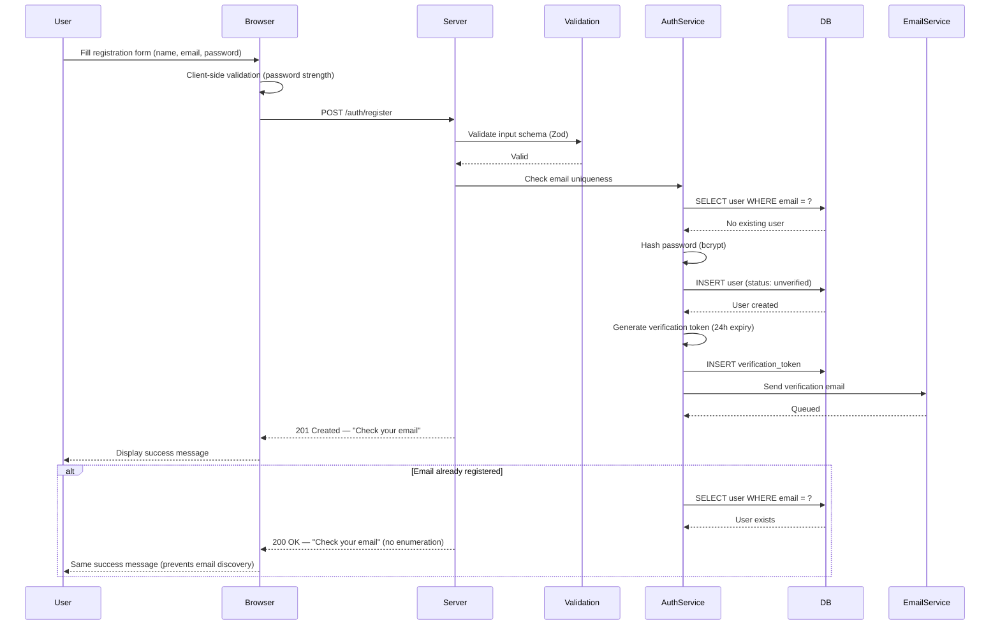

---

## 2. Sign In

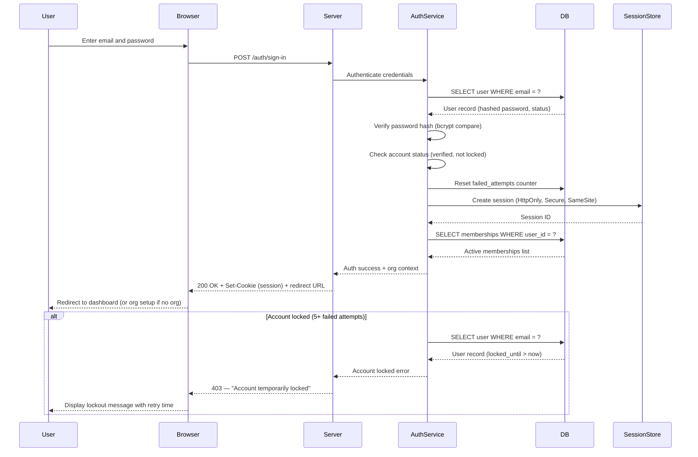

---

## 3. Password Reset

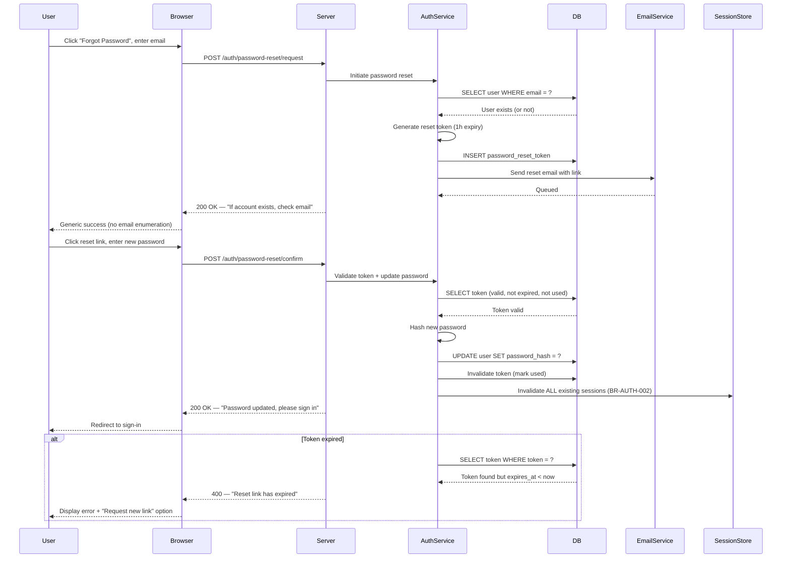

---

## 4. Invitation Acceptance

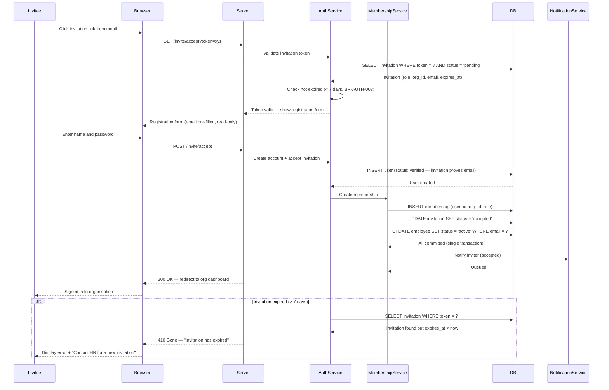

---

## 5. Organisation Setup

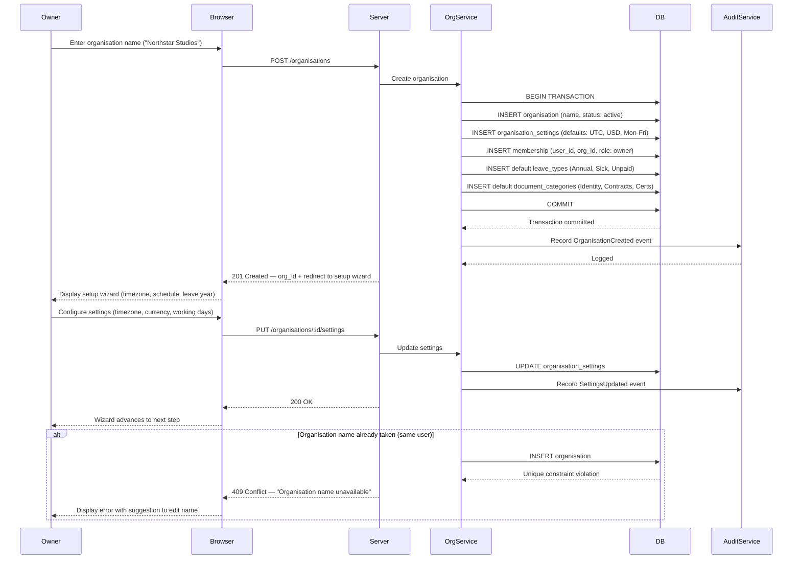

---

## 6. Employee Creation (with Login)

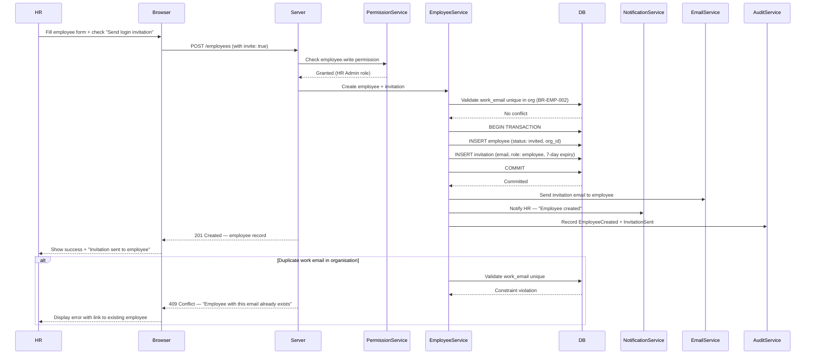

---

## 7. Employee Creation (without Login)

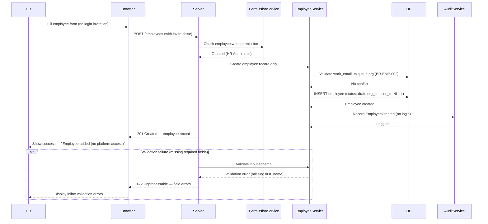

---

## 8. Leave Request

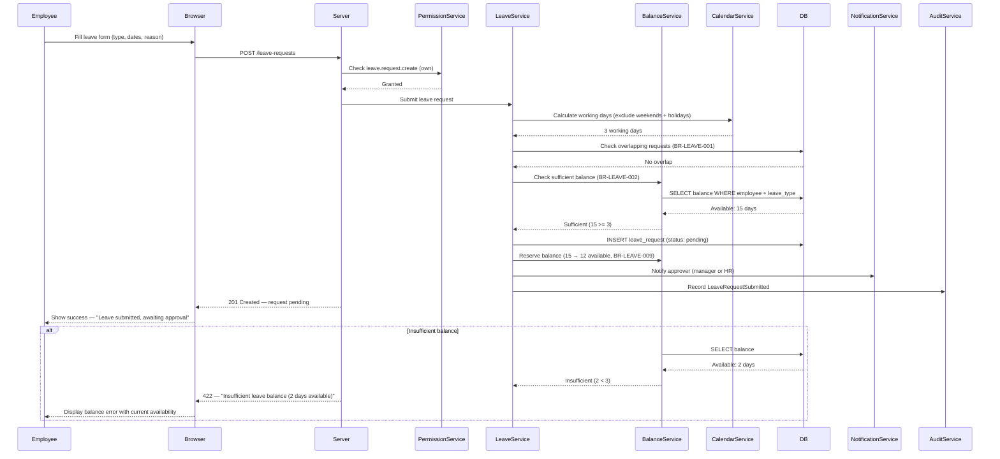

---

## 9. Leave Approval

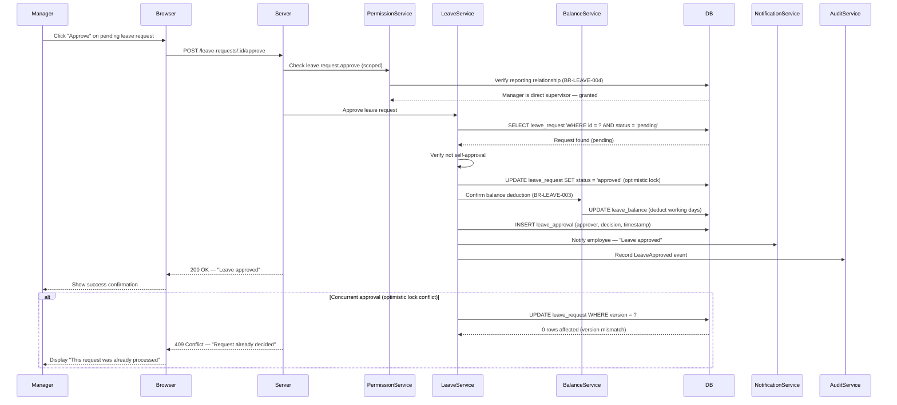

---

## 10. Clock In

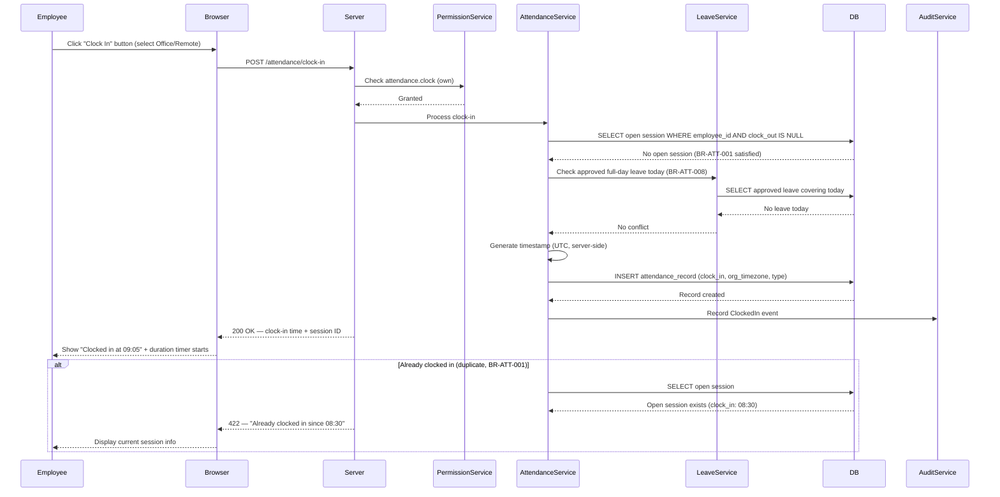

---

## 11. Clock Out

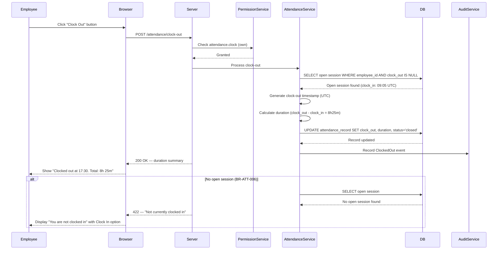

---

## 12. Attendance Correction

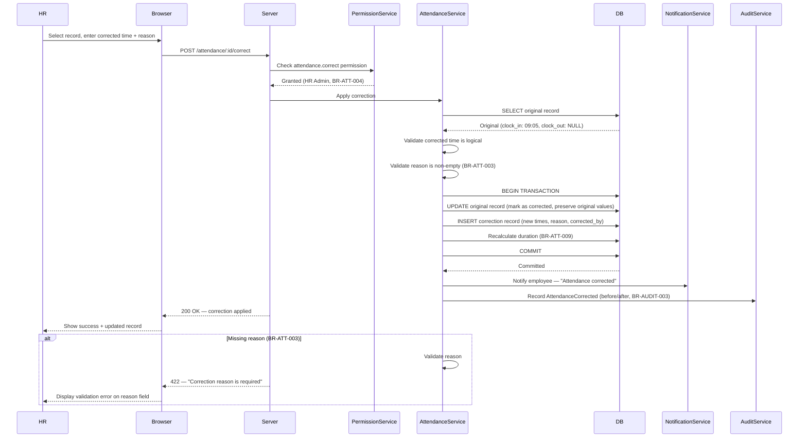

---

## 13. Onboarding Assignment

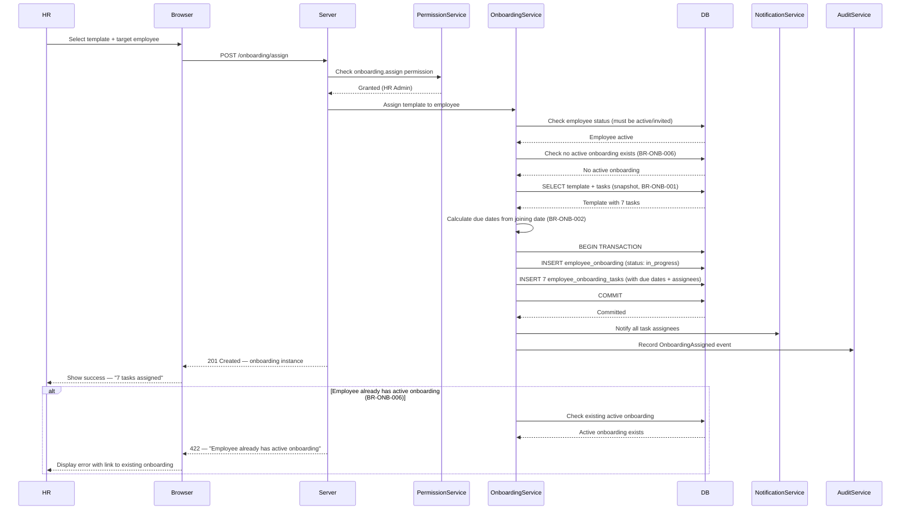

---

## 14. Document Upload

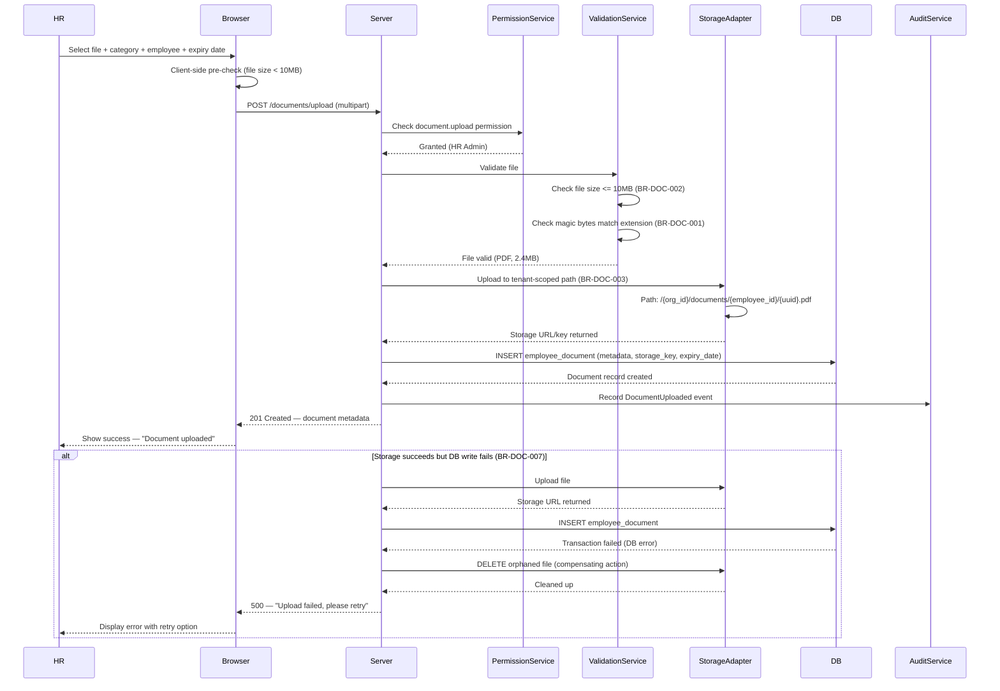

---

## 15. Document Download

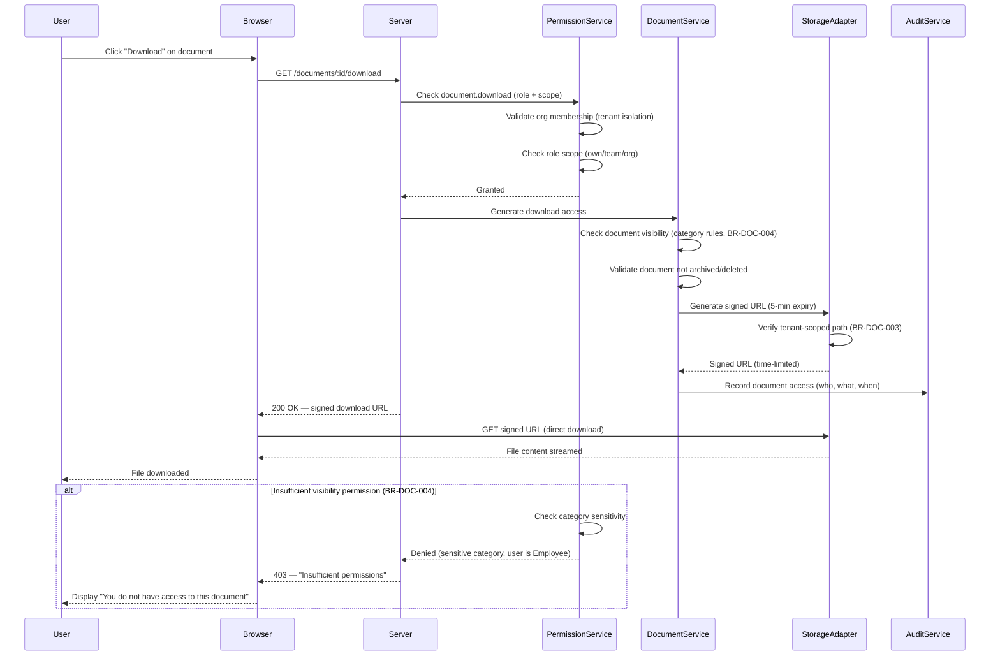

---

## 16. Payroll Publication

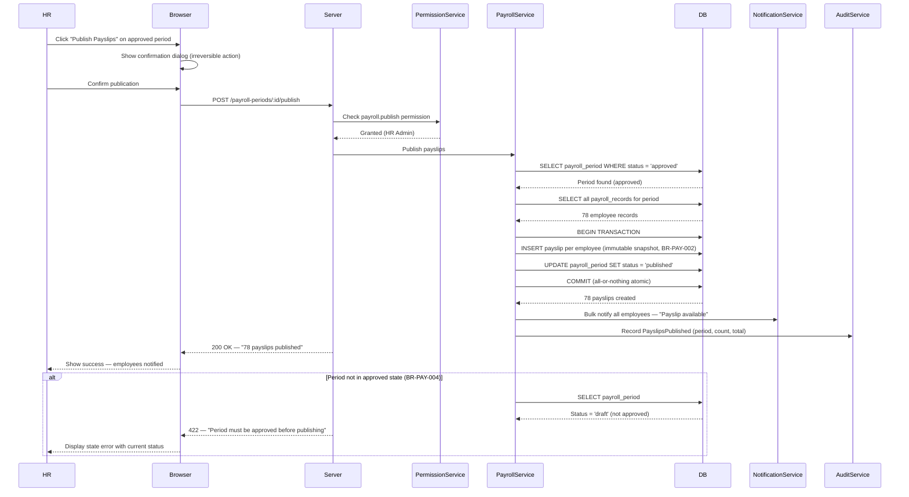

---

## 17. Dashboard Loading

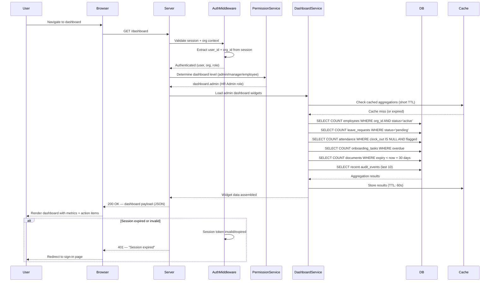

---

## Cross-Cutting Patterns

All sequence diagrams above share these patterns:

1. **Tenant Isolation**: Organisation ID always derived from authenticated session, never from request parameters (BR-ORG-002)
2. **Permission-First**: Every mutation checks permissions before executing business logic (BR-PERM-001)
3. **Audit Trail**: All state-changing operations record audit events within the same transaction (BR-AUDIT-002)
4. **Optimistic Locking**: Shared resources use version checks to prevent lost updates (BR-DATA-004)
5. **UTC Storage**: All timestamps stored in UTC; presentation layer converts to org timezone (BR-DATA-002)
6. **Graceful Failure**: Errors return consistent shapes with actionable messages (BR-PERM-003)
7. **Idempotency**: Critical operations (approval, publication) guard against duplicate execution
