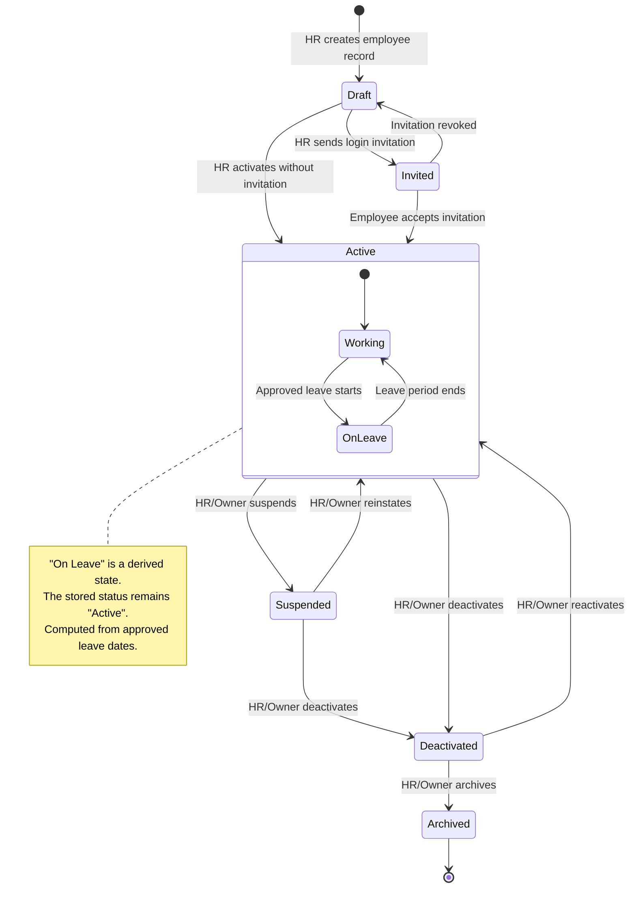
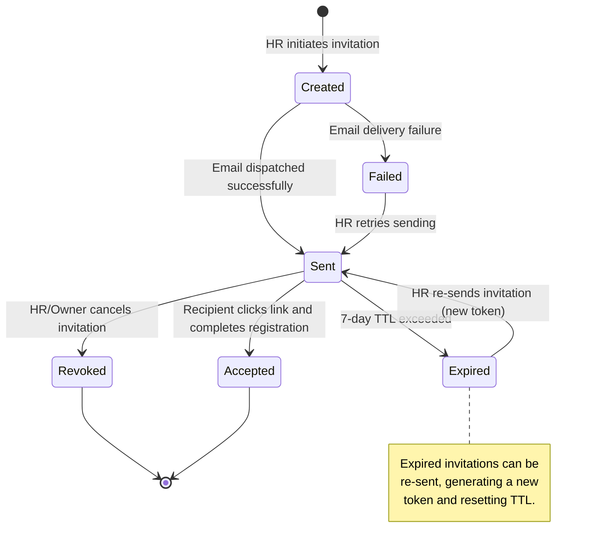
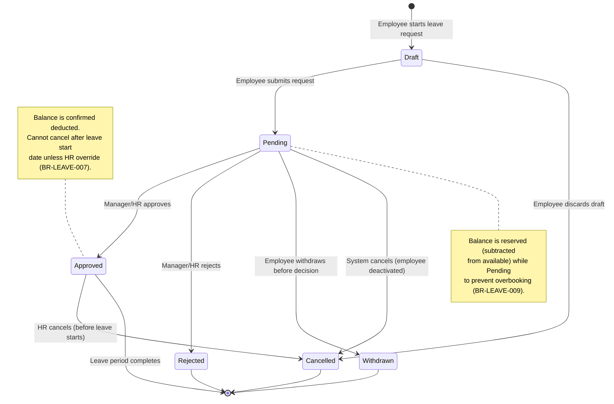
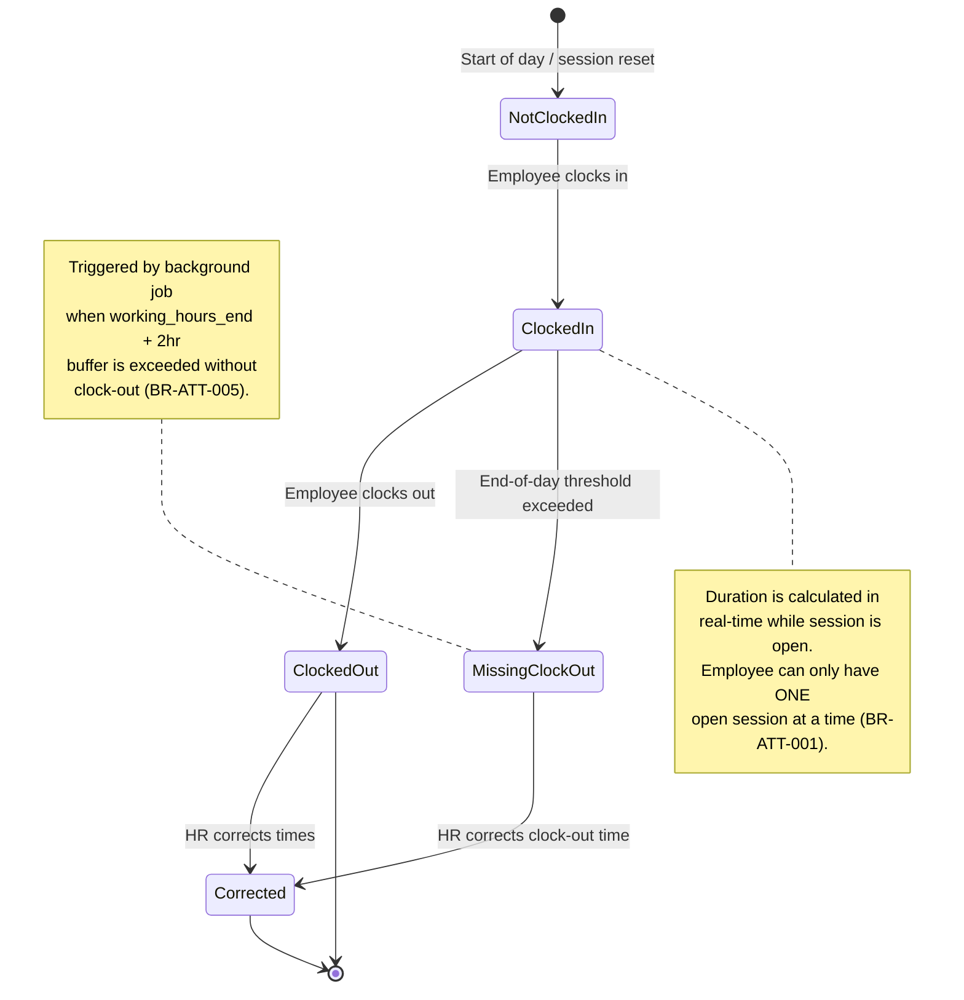
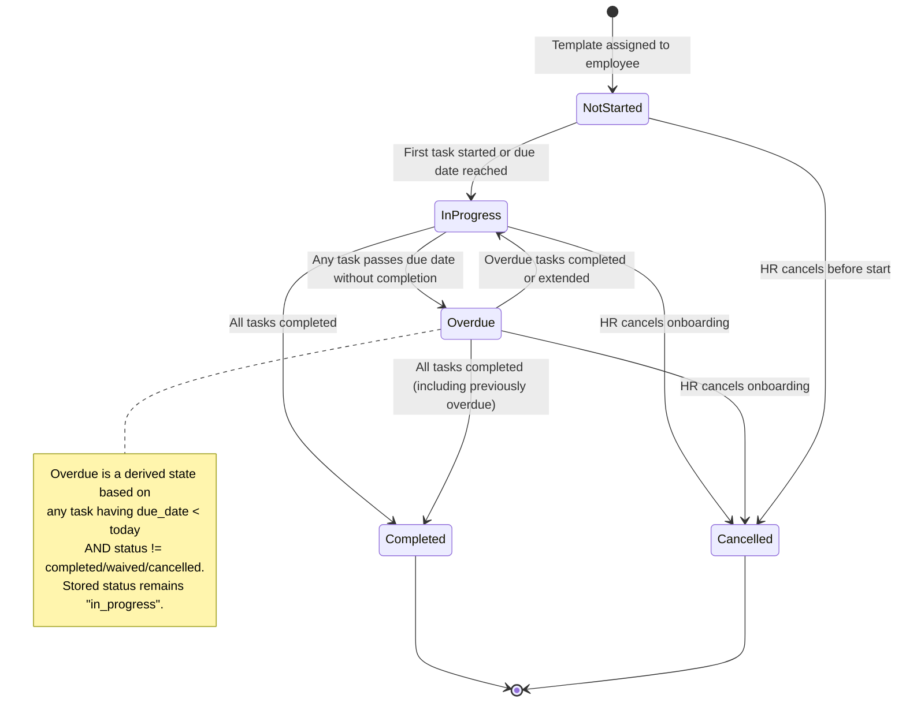
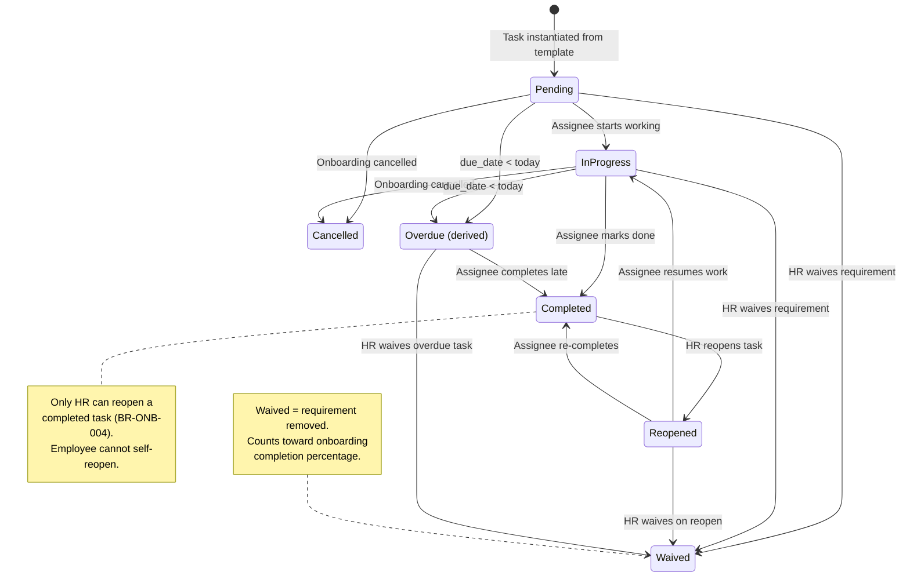
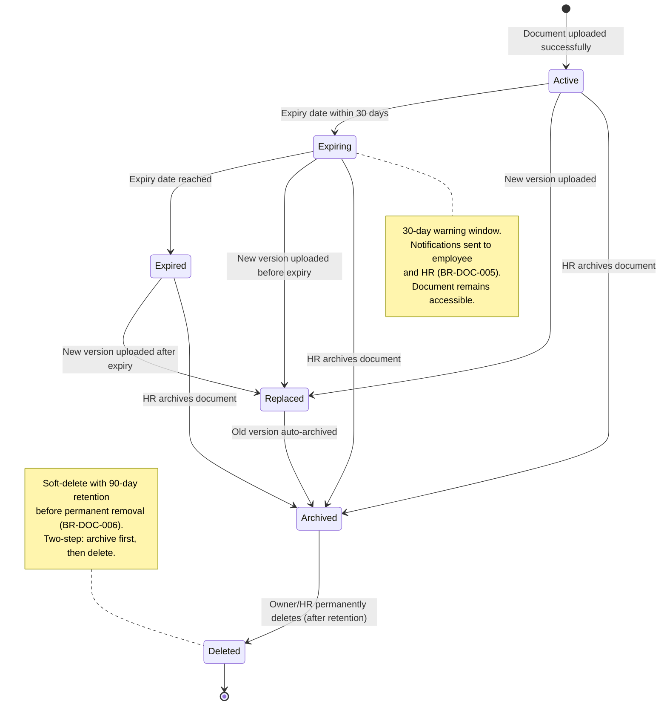
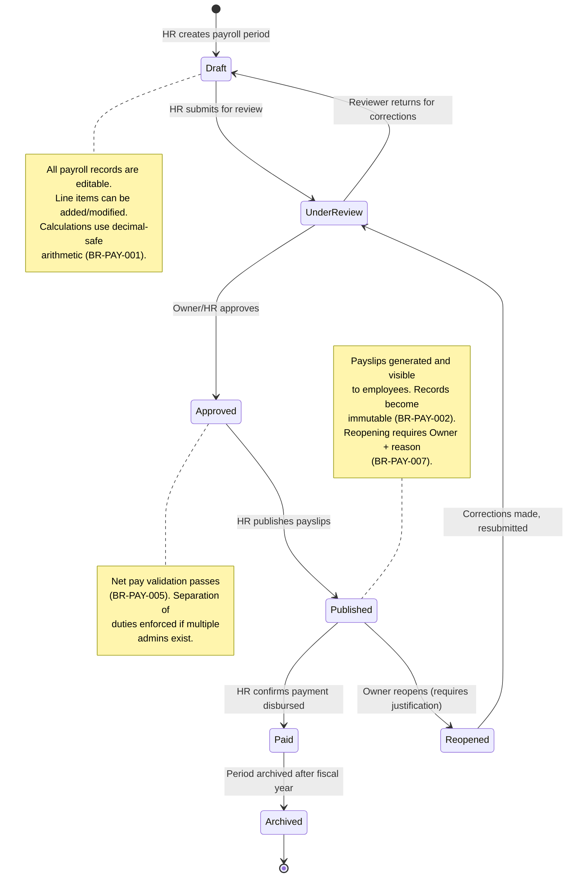

# State Machine Diagrams

This document defines the complete lifecycle state machines for all major entities in HR Daddy V1. Each state machine includes a Mermaid diagram followed by a detailed documentation table covering entry conditions, exit conditions, allowed actors, side effects, notifications, audit events, and data constraints.

---

## 1. Employee Lifecycle

The employee lifecycle tracks an individual from initial record creation through active employment to eventual archival. Some states are **stored** (persisted in the database `employment_status` field) while others are **derived** (computed at read time from related data).

**Stored states:** Draft, Invited, Active, Suspended, Deactivated, Archived

**Derived states:** On Leave (employee has Active stored status but an approved leave request covering the current date)

### Employee Lifecycle State Documentation

| State | Entry Conditions | Exit Conditions | Allowed Actors | Side Effects | Notifications | Audit Events | Data Constraints |
|-------|-----------------|-----------------|----------------|--------------|---------------|--------------|------------------|
| **Draft** | HR/Owner creates a new employee record via the employee creation form. Minimum required fields: first name, last name, work email. | Transition to Invited (invitation sent) or Active (manual activation). | Owner, HR Administrator | Employee record created in database with `employment_status = 'draft'`. No login access. No attendance, leave, or onboarding possible. | None | `employee.created` — actor, employee_id, org_id, timestamp | `work_email` must be unique within organisation. `organisation_id` NOT NULL. Employee ID auto-generated. |
| **Invited** | HR/Owner triggers an invitation from a Draft employee. System generates invitation token and sends email. | Transition to Active (invitation accepted) or back to Draft (invitation revoked). Auto-transition: invitation expires after 7 days (remains Invited but token invalidated; requires re-invitation). | Owner, HR Administrator (to invite); Employee (to accept) | Invitation record created with token, expiry timestamp. Email dispatched to employee's work email. User account may be pre-provisioned or created on acceptance. | Email invitation sent to employee's work email with accept link | `employee.invited` — actor, employee_id, invitation_id, expiry | Invitation token must be cryptographically secure. Token has 7-day TTL (BR-AUTH-003). One active invitation per employee at a time. |
| **Active** | Employee accepts invitation OR HR manually activates a Draft employee. Employee can now log in (if User account linked), clock attendance, submit leave, access documents. | Transition to Suspended, Deactivated. | Owner, HR Administrator (to change status); Employee (self-service while active) | If transitioning from Invited: User account linked to employee record, membership created with role. If from Draft: manual activation, no User account created (employee without login). Onboarding can now be assigned. | Welcome notification (in-app) if User account exists. Manager notified of new team member. | `employee.activated` — actor, employee_id, previous_status, activation_method | Employee must have `organisation_id`. If User-linked, `user_id` must reference valid User. Leave balance initialised based on joining date and leave policies. |
| **On Leave** (derived) | Employee has Active stored status AND there exists an approved leave request where `start_date <= today <= end_date`. | Leave period ends (date passes end_date) OR leave is cancelled. | System (automatic derivation) | Clock-in is blocked for full-day leave (BR-ATT-008). UI displays "On Leave" badge. Employee directory shows leave indicator. | None (notifications sent at leave approval time, not at derived state change) | None (no state transition stored) | This is NOT a stored status. Queried via: `SELECT ... WHERE employment_status = 'active' AND EXISTS (approved leave covering today)`. |
| **Suspended** | Owner or HR Administrator suspends an active employee. Requires a reason. Used for disciplinary actions or investigations. | Transition to Active (reinstatement) or Deactivated (termination). | Owner, HR Administrator | Login access revoked immediately (session invalidated). Open attendance sessions closed. Pending leave requests frozen (not cancelled — may be resumed on reinstatement). Employee hidden from leave calendar. | Employee notified of suspension (if has User account). Manager notified. | `employee.suspended` — actor, employee_id, reason, timestamp | Reason field is mandatory (NOT NULL). Suspension start date recorded. Employee retains all historical data. Cannot submit leave or clock in while suspended. |
| **Deactivated** | Owner or HR Administrator deactivates an employee (employment ended). Can come from Active or Suspended state. | Transition to Active (reactivation) or Archived. | Owner, HR Administrator | Login access permanently revoked. All active sessions invalidated. Pending leave requests cancelled (BR-EMP-004). Open attendance sessions force-closed. Active onboarding cancelled. Employee removed as approver from pending requests. Manager's direct reports updated. | Employee notified (final notification). Manager notified of team change. HR notified. | `employee.deactivated` — actor, employee_id, reason, effective_date, cascaded_actions | Deactivation date recorded. All cascading effects executed in single transaction. Employee record retained for compliance. Cannot log in, submit leave, clock in, or be assigned tasks. |
| **Archived** | Owner or HR Administrator archives a deactivated employee. Moves record to cold storage visibility. | Terminal state — no further transitions in V1. (Un-archiving may be added in V2.) | Owner, HR Administrator | Employee excluded from all default queries (directory, reports, calendars). Data retained but not displayed unless explicitly queried via archive view. | None | `employee.archived` — actor, employee_id, timestamp | Must be in Deactivated state before archiving (BR-EMP-003). `archived_at` timestamp set. Record still exists for audit trail integrity. Foreign key references maintained. |

### Invalid Transitions (Employee)

The following transitions are explicitly **not allowed** and must be rejected by the state machine validator:

- Draft → Suspended (must be Active first)
- Draft → Deactivated (must be Active first)
- Draft → Archived (must be Deactivated first)
- Invited → Suspended (must be Active first)
- Invited → Deactivated (must be Active first)
- Invited → Archived (must be Deactivated first)
- Active → Archived (must be Deactivated first)
- Suspended → Archived (must be Deactivated first)
- Archived → any state (terminal in V1)

---

## 2. Invitation Lifecycle

The invitation lifecycle tracks the state of a login invitation sent to an employee, from creation through to acceptance, expiry, or revocation.

### Invitation Lifecycle State Documentation

| State | Entry Conditions | Exit Conditions | Allowed Actors | Side Effects | Notifications | Audit Events | Data Constraints |
|-------|-----------------|-----------------|----------------|--------------|---------------|--------------|------------------|
| **Created** | HR/Owner initiates an invitation for an employee. Invitation record created with token, target email, role, and expiry. | Transition to Sent (email dispatched) or Failed (delivery error). | Owner, HR Administrator | Invitation record persisted with: `token` (cryptographic), `email`, `role`, `organisation_id`, `employee_id`, `expires_at` (now + 7 days), `status = 'created'`. | None yet (email not sent) | `invitation.created` — actor, invitation_id, target_email, role, org_id | Token must be 256-bit cryptographically random. `expires_at = created_at + 7 days`. One active invitation per employee email per organisation. Previous expired/revoked invitations for same email are allowed. |
| **Sent** | Email service confirms successful dispatch of invitation email to the recipient's address. | Transition to Accepted, Expired, or Revoked. | System (automatic on email dispatch confirmation) | Status updated to 'sent'. `sent_at` timestamp recorded. Email contains: accept URL with token, organisation name, role description, expiry notice. | Email sent to target: invitation with accept link, org name, instructions | `invitation.sent` — invitation_id, email, sent_at | `sent_at` timestamp NOT NULL. Email content must not expose internal system details. Accept URL contains token as query parameter over HTTPS only. |
| **Accepted** | Recipient clicks the invitation link, token is validated (not expired, not revoked), and the recipient completes account setup (or links existing account). | Terminal state. | Invitee (the recipient) | Token permanently invalidated (BR-AUTH-008). User account created (or existing account linked). Membership created with specified role. Employee record transitioned to Active. Session established. | Welcome notification (in-app). HR notified of acceptance. Manager notified of new team member. | `invitation.accepted` — invitation_id, user_id, employee_id, accepted_at | Token consumed atomically (single-use, BR-AUTH-008). User account must be valid. Membership role matches invitation role. Employee `employment_status` transitions from Invited to Active. |
| **Expired** | System clock passes `expires_at` timestamp (7 days after creation). Checked at acceptance attempt time or via background job. | Can transition to Sent (re-invitation with new token). | System (automatic expiry); Owner/HR Admin (to re-send) | Token invalidated. Status set to 'expired'. No access granted. If checked during acceptance attempt: error returned to user. | None on expiry itself. If recipient attempts to use: error page shown. | `invitation.expired` — invitation_id, expired_at | `expired_at` timestamp set. Original token can no longer be used. Re-sending creates a new invitation record (or updates existing with fresh token and TTL). |
| **Revoked** | Owner or HR Administrator manually cancels an outstanding invitation before it is accepted or expires. | Terminal state. Cannot be re-sent (must create new invitation). | Owner, HR Administrator | Token permanently invalidated. Status set to 'revoked'. Employee record remains in current state (Draft or Invited depending on flow). | None to recipient. HR notified if different actor revoked. | `invitation.revoked` — actor, invitation_id, reason, revoked_at | `revoked_at` timestamp set. Revocation reason optional but recommended. If recipient attempts to use revoked token: error "This invitation has been cancelled." |
| **Failed** | Email delivery fails (bounce, invalid address, service error). | Can transition to Sent (retry). | System (automatic on delivery failure); Owner/HR Admin (to retry) | Delivery failure recorded. Retry count incremented. After 3 failures, invitation remains in Failed state requiring manual intervention. | HR notified of delivery failure | `invitation.delivery_failed` — invitation_id, failure_reason, attempt_count | `failure_reason` captured from email service. `retry_count` tracked. Max 3 automatic retries. After max retries, requires manual re-send or address correction. |

---

## 3. Leave Request Lifecycle

The leave request lifecycle tracks a time-off request from initial creation through approval or rejection. This is one of the most complex state machines due to multiple valid and invalid transitions, balance implications, and multi-actor involvement.

### Leave Request Lifecycle State Documentation

| State | Entry Conditions | Exit Conditions | Allowed Actors | Side Effects | Notifications | Audit Events | Data Constraints |
|-------|-----------------|-----------------|----------------|--------------|---------------|--------------|------------------|
| **Draft** | Employee begins filling out a leave request form but has not yet submitted. Request is saved locally or as a server-side draft. | Transition to Pending (submission) or Cancelled (discard). | Employee (creator) | Draft record created with: leave_type_id, start_date, end_date, half_day flag, reason, attachment references. No balance reservation yet. No approver notified. | None | None (drafts are not audited until submission) | `employee_id` must reference active employee. `leave_type_id` must be valid for organisation. Dates must be in the future (or today). Draft does not affect balance calculations. |
| **Pending** | Employee submits the draft request. System validates: sufficient balance (BR-LEAVE-002), no overlap (BR-LEAVE-001), valid working days. | Transition to Approved, Rejected, Withdrawn, or Cancelled. | Employee (to withdraw); Manager (to approve/reject for direct reports); Owner/HR Admin (to approve/reject any) | Balance reserved — requested days subtracted from available balance (BR-LEAVE-009). Approver determined from reporting relationship (or HR fallback if no manager, BR-LEAVE-010). Working days calculated excluding weekends and holidays (BR-LEAVE-005). | Manager/approver notified of pending request. Employee receives confirmation of submission. | `leave.request.submitted` — actor (employee), request_id, leave_type, dates, duration_days | Balance must be sufficient at submission time. No overlap with existing Approved or Pending requests for same employee. Duration calculated in working days. `submitted_at` timestamp set. `approver_id` resolved and stored. |
| **Approved** | Manager or HR/Owner approves the pending request. Validates: request is still Pending, approver has authority, not self-approval. | Leave period completes naturally, or HR cancels before start date. Terminal after completion. | Manager (for direct reports); Owner, HR Administrator (for any employee); HR Admin (override via `leave.request.override`) | Balance confirmed deducted (transition from reserved to consumed). Leave calendar updated. Employee marked as "On Leave" (derived) during the leave dates. Attendance clock-in blocked for full-day approved leave dates. | Employee notified of approval. Team calendar updated for manager view. | `leave.request.approved` — actor (approver), request_id, employee_id, duration, balance_after | `approved_at` timestamp set. `approved_by` user_id recorded. Balance deduction is idempotent (already reserved). Self-approval prevented (BR-LEAVE-004 exception handling needed for Owner/HR Admin). Optimistic locking to prevent double-approval race condition (BR-DATA-004). |
| **Rejected** | Manager or HR/Owner rejects the pending request. Mandatory reason required. | Terminal state. | Manager (for direct reports); Owner, HR Administrator (for any) | Reserved balance restored to available. No calendar entry created. Request retained for history. | Employee notified of rejection with reason. | `leave.request.rejected` — actor (approver), request_id, reason, employee_id | `rejected_at` timestamp set. `rejected_by` user_id. `rejection_reason` NOT NULL (mandatory, BR-LEAVE-004 enforcement). Balance reservation released atomically with status change. |
| **Withdrawn** | Employee voluntarily withdraws their own pending request before a decision is made. | Terminal state. | Employee (request creator only) | Reserved balance restored to available. Approver's pending queue updated (request removed). | Approver notified that request was withdrawn. | `leave.request.withdrawn` — actor (employee), request_id, withdrawn_at | `withdrawn_at` timestamp set. Can only withdraw from Pending state. Cannot withdraw after approval or rejection. Balance reservation released. |
| **Cancelled** | System cancels (employee deactivated while request is Pending) OR HR cancels an approved request before the leave start date. HR override can cancel after start date (BR-LEAVE-007, BR-LEAVE-008). | Terminal state. | System (automatic on employee deactivation); Owner, HR Administrator (manual cancellation) | If was Pending: reserved balance restored. If was Approved and before start date: consumed balance restored (BR-LEAVE-006). If was Approved and after start date: balance NOT restored (partial leave taken). Calendar entry removed. | Employee notified (if still has account). Manager notified. | `leave.request.cancelled` — actor, request_id, reason, cancellation_type (system/manual), balance_restored | `cancelled_at` timestamp set. `cancelled_by` user_id (or 'system'). `cancellation_reason` stored. Balance adjustment depends on timing relative to leave start date. Past leave cannot be cancelled by employee (only HR override). |

### Valid and Invalid Transitions (Leave Request)

**Valid transitions:**
| From | To | Trigger |
|------|-----|---------|
| Draft | Pending | Employee submits |
| Draft | Cancelled | Employee discards |
| Pending | Approved | Approver approves |
| Pending | Rejected | Approver rejects |
| Pending | Withdrawn | Employee withdraws |
| Pending | Cancelled | System (deactivation) |
| Approved | Cancelled | HR cancels (before start date, or override) |

**Invalid transitions (must be rejected):**
| From | To | Reason |
|------|-----|--------|
| Draft | Approved | Cannot skip Pending; must be submitted first |
| Draft | Rejected | Cannot reject what hasn't been submitted |
| Pending | Draft | Cannot un-submit; withdraw instead |
| Approved | Pending | Cannot un-approve; cancel instead |
| Approved | Rejected | Cannot reject after approval; cancel instead |
| Rejected | Pending | Cannot re-submit rejected; create new request |
| Rejected | Approved | Cannot approve rejected; use HR override to create new |
| Withdrawn | Pending | Cannot un-withdraw; create new request |
| Cancelled | any state | Terminal state; create new request |

---

## 4. Attendance Session Lifecycle

The attendance session lifecycle tracks an employee's daily clock-in/clock-out cycle, including handling of edge cases like missing clock-outs and HR corrections.

### Attendance Session Lifecycle State Documentation

| State | Entry Conditions | Exit Conditions | Allowed Actors | Side Effects | Notifications | Audit Events | Data Constraints |
|-------|-----------------|-----------------|----------------|--------------|---------------|--------------|------------------|
| **Not Clocked In** | Default state at the start of each working day, or after a session is closed (clocked out / corrected). No open attendance session exists for the employee. | Transition to Clocked In when employee clocks in. | Employee (to clock in); System (state is implicit — absence of an open session) | No attendance record exists for the current session. Dashboard shows employee as "Not present." Employee directory shows no attendance badge. | None | None (absence of action is not audited) | No open attendance record exists where `clock_out_at IS NULL` for this employee. Employee must be Active (not Suspended or Deactivated). Employee must not have full-day approved leave for today (BR-ATT-008). |
| **Clocked In** | Employee performs clock-in action. System validates: no existing open session (BR-ATT-001), employee is Active, no full-day leave today (BR-ATT-008). | Transition to Clocked Out (employee clocks out) or Missing Clock-Out (threshold exceeded). | Employee (to clock out); System (to detect missing clock-out) | Attendance record created with: `employee_id`, `clock_in_at` (UTC), `type` (office/remote), `organisation_id`. Duration begins accumulating (calculated as `now() - clock_in_at`). Dashboard updated: employee shown as "Present." | None on clock-in (routine action). Manager can see "present" status in team view. | `attendance.clocked_in` — employee_id, clock_in_at, type, ip_address | `clock_in_at` stored in UTC (BR-ATT-002). Only ONE open session per employee (BR-ATT-001 — enforced by unique partial index or check). `organisation_id` from session context. IP address logged for audit but not displayed. Overnight sessions belong to clock-in date (BR-ATT-007). |
| **Clocked Out** | Employee performs clock-out action. System validates: open session exists (BR-ATT-006). Clock-out time must be after clock-in time. | Terminal for normal flow. Can transition to Corrected if HR adjusts times. | Employee (to clock out) | Attendance record updated: `clock_out_at` (UTC) set. `duration` calculated automatically as `clock_out_at - clock_in_at` (BR-ATT-009). Session closed. Dashboard updated: employee shown with duration for today. | None (routine action) | `attendance.clocked_out` — employee_id, clock_out_at, duration, session_id | `clock_out_at` must be > `clock_in_at`. Duration derived from timestamps, never manually entered (BR-ATT-009). Record is now complete. Stored in UTC, displayed in org timezone (BR-ATT-002). |
| **Missing Clock-Out** | Background job or end-of-day check detects: employee has an open session AND current time exceeds `working_hours_end + 2 hour buffer` (BR-ATT-005). | Transition to Corrected when HR provides the actual clock-out time. | System (automatic detection); Owner, HR Administrator (to correct) | Attendance record flagged: `status = 'missing_clock_out'`. No duration calculated (incomplete data). Record appears in HR dashboard under "Requires Attention" widget. | Employee notified: "You forgot to clock out. Please contact HR." HR notified: "Missing clock-out for [employee] on [date]." | `attendance.missing_clock_out` — employee_id, session_id, detected_at | `status` field set to 'missing_clock_out'. `clock_out_at` remains NULL. Duration cannot be calculated. Record excluded from accurate attendance summaries until corrected. Flags this for HR action queue. |
| **Corrected** | HR Administrator or Owner corrects an attendance record (either a missing clock-out or an inaccurate time). Requires mandatory reason (BR-ATT-003). | Terminal state. | Owner, HR Administrator | Original record preserved (snapshot). Correction applied: updated `clock_in_at` and/or `clock_out_at`. `duration` recalculated. `corrected_by`, `corrected_at`, `correction_reason` fields populated. `status = 'corrected'`. Links to original values for audit trail. | Employee notified: "Your attendance for [date] has been corrected by HR." | `attendance.corrected` — actor, session_id, original_values, corrected_values, reason | `correction_reason` NOT NULL (BR-ATT-003). `corrected_by` references HR/Owner user_id. Original `clock_in_at` and `clock_out_at` preserved in audit or separate columns. Correction must be within allowed window (default 30 days). Only HR/Owner can correct (BR-ATT-004). |

---

## 5. Onboarding Lifecycle

The onboarding lifecycle tracks the overall progress of an employee's onboarding process from template assignment through completion. This is the **instance-level** lifecycle (per employee), not the template.

### Onboarding Lifecycle State Documentation

| State | Entry Conditions | Exit Conditions | Allowed Actors | Side Effects | Notifications | Audit Events | Data Constraints |
|-------|-----------------|-----------------|----------------|--------------|---------------|--------------|------------------|
| **Not Started** | HR assigns an onboarding template to an employee. Tasks are generated with due dates relative to joining date (BR-ONB-002). Employee must be Active or Invited. Only one active onboarding per employee (BR-ONB-006). | Transition to In Progress (first task action) or Cancelled (HR cancels). | Owner, HR Administrator (to assign/cancel) | Employee onboarding instance created. Tasks instantiated as copies from template (BR-ONB-001 — snapshot, not reference). Due dates calculated from `employee.joining_date + task.relative_days`. All tasks created in Pending state. | Employee notified: "Your onboarding checklist is ready." All task assignees notified of their assigned tasks. Manager notified of new hire onboarding. | `onboarding.assigned` — actor, employee_id, template_id, task_count, onboarding_id | One active onboarding per employee (BR-ONB-006). Tasks are independent copies (template changes don't propagate, BR-ONB-001). `joining_date` must be set on employee record. All tasks generated in single transaction. |
| **In Progress** | First task is started (status changed to in_progress) OR the onboarding start date is reached (joining date). At least one task exists that is not in a terminal state. | Transition to Completed (all tasks done), or Cancelled. May show as Overdue if any task is past due. | Employee (own tasks); Manager (team tasks); Owner, HR Admin (any task, cancel) | Individual tasks are being worked on. Progress percentage tracked (`completed_tasks / total_tasks`). Dashboard widget shows onboarding progress. | Task-specific reminders as due dates approach (3 days before, 1 day before, on due date). | Individual task events (see Task Lifecycle below) | At least one task must be in a non-terminal state (pending/in_progress). Progress calculated as: `(completed + waived) / total_tasks * 100`. |
| **Completed** | All tasks in the onboarding instance have reached a terminal state (Completed or Waived). No tasks remain in Pending or In Progress. | Terminal state. | System (automatic when last task completes) | Onboarding instance marked complete. `completed_at` timestamp set. Completion percentage = 100%. Removed from "active onboarding" dashboard views. | Employee notified: "Congratulations! Your onboarding is complete." HR notified of completion. Manager notified. | `onboarding.completed` — onboarding_id, employee_id, completed_at, duration_days, tasks_completed, tasks_waived | `completed_at` timestamp set. All tasks must be in terminal state. Duration = `completed_at - created_at`. Cannot reopen after completion (create new onboarding if needed). |
| **Overdue** (derived) | One or more tasks have `due_date < today()` AND task status is Pending or In Progress. This is a derived view state — stored status remains "in_progress". | Overdue tasks are completed, extended (due date moved), or waived. Returns to clean In Progress when no overdue tasks remain. | System (automatic derivation) | Dashboard highlights overdue items in red. Overdue task count shown on HR and manager dashboards. Escalation notifications triggered. | HR notified daily of overdue tasks. Manager notified of their team's overdue items. Employee reminded of their overdue tasks. | None (derived state, no stored transition) | Computed as: `EXISTS (task WHERE onboarding_id = X AND due_date < NOW() AND status IN ('pending', 'in_progress'))`. Not a stored `status` value. |
| **Cancelled** | HR/Owner cancels the onboarding process. Common reasons: employee departed before completion, onboarding template was assigned in error, or employee deactivated (BR-ONB-005, BR-EMP-004). | Terminal state. | Owner, HR Administrator; System (automatic on employee deactivation) | All incomplete tasks (Pending, In Progress) set to Cancelled status (BR-ONB-005). Already-completed tasks remain as historical record. `cancelled_at` and `cancelled_reason` recorded. | All task assignees notified of cancellation. Employee notified (if still active). | `onboarding.cancelled` — actor, onboarding_id, employee_id, reason, tasks_cancelled_count | `cancelled_at` timestamp set. `cancelled_by` user_id (or 'system'). `cancellation_reason` stored. Completed tasks NOT reverted. Incomplete tasks bulk-updated to cancelled in single transaction. |

---

## 6. Onboarding Task Lifecycle

The onboarding task lifecycle tracks individual tasks within an employee's onboarding instance. Each task has an assignee (Employee, Manager, or HR) and a relative due date.

### Onboarding Task Lifecycle State Documentation

| State | Entry Conditions | Exit Conditions | Allowed Actors | Side Effects | Notifications | Audit Events | Data Constraints |
|-------|-----------------|-----------------|----------------|--------------|---------------|--------------|------------------|
| **Pending** | Task instantiated when onboarding template is assigned to employee. Created with assignee, description, and calculated due date. | Transition to In Progress (work started), Waived (HR removes requirement), or Cancelled (onboarding cancelled). Becomes Overdue (derived) if `due_date < today`. | Assignee (to start); Owner, HR Admin (to waive/cancel) | Task record created with: `title`, `description`, `assignee_type` (employee/manager/hr), `assignee_id`, `due_date`, `onboarding_id`, `status = 'pending'`. | Assignee notified of new task. Reminder at due_date - 3 days. Reminder at due_date - 1 day. | `onboarding.task.created` — task_id, onboarding_id, assignee_id, due_date | `due_date` calculated as `employee.joining_date + template_task.relative_days` (BR-ONB-002). `assignee_id` resolved from assignee_type: employee = the onboarded employee, manager = their manager, hr = assigned HR admin. |
| **In Progress** | Assignee explicitly starts the task or begins working on it. Indicates active effort. | Transition to Completed, Waived, or Cancelled. Becomes Overdue (derived) if `due_date < today`. | Assignee (owner of task, BR-ONB-003) | `started_at` timestamp recorded. Progress visible in onboarding dashboard. Task moves from "To Do" to "In Progress" column in task views. | None (starting is a routine action) | `onboarding.task.started` — actor, task_id, started_at | `started_at` timestamp set. Task can only be started by the assigned owner (BR-ONB-003) unless HR override. |
| **Completed** | Assignee marks the task as done. Only the assigned owner can complete (BR-ONB-003). System checks if this was the last task → triggers onboarding completion. | Can transition to Reopened (HR only, BR-ONB-004). Otherwise terminal. | Assignee (to complete); Owner, HR Admin (to reopen) | `completed_at` timestamp set. `completed_by` user_id recorded. Onboarding progress percentage recalculated. If all tasks complete → onboarding instance transitions to Completed. | HR notified if a milestone task is completed. If last task: completion notifications sent (see Onboarding Completed). | `onboarding.task.completed` — actor, task_id, completed_at, onboarding_progress_pct | `completed_at` NOT NULL. `completed_by` must match assignee or be HR/Owner (override). Completion is idempotent (completing an already-completed task is a no-op). |
| **Reopened** | HR Administrator or Owner reopens a previously completed task. Employee cannot self-reopen (BR-ONB-004). Requires a reason. | Transition to In Progress (work resumes), Completed (re-completed), or Waived. | Owner, HR Administrator | `reopened_at` timestamp set. `reopened_by` user_id. `reopen_reason` stored. Task reappears in active task lists. Onboarding progress percentage recalculated (decreases). Onboarding instance status reverts from Completed to In Progress if it was completed. | Assignee notified: "Your task [title] has been reopened." Employee notified if different from assignee. | `onboarding.task.reopened` — actor, task_id, reason, reopened_at | `reopen_reason` NOT NULL. `reopened_by` must be HR or Owner (BR-ONB-004). If onboarding was Completed, it transitions back to In Progress. Previous completion record preserved in history. |
| **Waived** | HR/Owner determines the task requirement is no longer applicable (e.g., policy changed, not relevant to this employee's role). Counts as "done" for progress calculation. | Terminal state. | Owner, HR Administrator | `waived_at` timestamp. `waived_by` user_id. `waiver_reason` stored. Task counts toward completion percentage (treated as done). Onboarding completion check triggered. | Assignee notified: "Task [title] has been waived." | `onboarding.task.waived` — actor, task_id, reason, waived_at | `waiver_reason` NOT NULL. Waived tasks count as complete for `progress = (completed + waived) / total`. Cannot be un-waived (create new task if needed). |
| **Overdue** (derived) | Task has `due_date < today()` AND status is Pending or In Progress. This is a computed flag, not a stored status. | Task is completed, waived, or due date is extended by HR. | System (automatic derivation) | Dashboard highlights overdue tasks. Appears in "Overdue Tasks" report for HR. Escalation may trigger additional notifications. | Daily digest to HR: list of overdue tasks. Assignee reminded daily while overdue. Manager notified of their team's overdue items. | None (derived, not a stored transition) | Computed at query time: `WHERE due_date < NOW() AND status IN ('pending', 'in_progress')`. Not stored in `status` column. Due date can be extended by HR to resolve overdue state. |
| **Cancelled** | Onboarding instance is cancelled, cascading to all non-terminal tasks (BR-ONB-005). Individual tasks cannot be independently cancelled. | Terminal state. | System (cascade from onboarding cancellation) | `cancelled_at` timestamp. Status set to 'cancelled'. Task removed from active views. | Assignee notified as part of onboarding cancellation notification batch. | Captured as part of `onboarding.cancelled` parent event (individual task cancellations not separately audited) | Only triggered via onboarding-level cancellation (BR-ONB-005). Individual task cancellation without full onboarding cancellation is not supported in V1. Completed tasks are NOT cancelled (they retain completed status). |

---

## 7. Document Lifecycle

The document lifecycle tracks employee documents from upload through expiry management and eventual archival or deletion. Documents are subject to tenant-scoped storage (BR-DOC-003), file validation (BR-DOC-001), and soft-delete retention (BR-DOC-006).

### Document Lifecycle State Documentation

| State | Entry Conditions | Exit Conditions | Allowed Actors | Side Effects | Notifications | Audit Events | Data Constraints |
|-------|-----------------|-----------------|----------------|--------------|---------------|--------------|------------------|
| **Active** | Document uploaded successfully: file stored in tenant-scoped storage, metadata persisted in database. File validated (type, size, magic bytes). | Transition to Expiring (30-day warning), Replaced (new version), or Archived (manual). | Owner, HR Admin (upload for any employee); Employee (upload to own non-sensitive categories) | File stored at path `/{org_id}/{employee_id}/{document_id}/{filename}`. Metadata record created: `category_id`, `employee_id`, `uploaded_by`, `uploaded_at`, `expiry_date` (optional), `visibility`, `file_size`, `mime_type`. If upload succeeds but DB fails → storage cleanup (BR-DOC-007). | Employee notified: "A new document has been added to your profile." HR notified if employee self-uploaded. | `document.uploaded` — actor, document_id, employee_id, category, filename, size | File must pass type validation (BR-DOC-001: magic byte check). Size ≤ 10MB (BR-DOC-002). Storage path must include `org_id` (BR-DOC-003). `organisation_id` NOT NULL. `employee_id` NOT NULL. `category_id` NOT NULL. |
| **Expiring** (derived) | Document has an `expiry_date` AND `expiry_date - today() <= 30 days` AND `expiry_date > today()`. Computed by daily background job or at query time. | Transition to Expired (date reached), Replaced (new version uploaded), or Archived. | System (automatic detection); Owner, HR Admin (to replace/archive) | Document flagged with `expiring_soon` indicator. Appears in HR dashboard "Expiring Documents" widget. Warning badge shown on employee profile document section. | Employee notified: "Your [document name] expires on [date]. Please upload a new version." HR notified: "[Employee] has a document expiring on [date]." (BR-DOC-005) | None (derived state, no stored transition; notifications are the side effect) | Computed: `WHERE expiry_date IS NOT NULL AND expiry_date > NOW() AND expiry_date <= NOW() + INTERVAL '30 days'`. Document remains fully accessible and downloadable. Notification sent once (tracked to prevent duplicates). |
| **Expired** | Document's `expiry_date < today()`. The document is past its validity period. | Transition to Replaced (new version uploaded) or Archived. | System (automatic); Owner, HR Admin (to replace/archive) | Document flagged as expired. Remains accessible for reference but marked with warning. Appears in HR compliance report. May affect employee compliance status. | HR notified: "[Document] for [employee] has expired." Employee notified: "Your [document] has expired. Please provide an updated version." | `document.expired` — document_id, employee_id, expiry_date, expired_at | `expired_at` timestamp set (or derived from `expiry_date`). Document NOT automatically deleted (BR-DOC-005). Remains accessible. Expired flag visible in UI. Used for compliance reporting. |
| **Replaced** | HR or Employee uploads a new version of an existing document. The previous version transitions to Replaced state and is retained according to retention policy. | Typically transitions to Archived (old version auto-archived). | Owner, HR Admin (any document); Employee (own non-sensitive documents) | New document record created as the current version. Previous document's `status = 'replaced'`, `replaced_by = new_document_id`, `replaced_at` timestamp. Previous version retained in storage. New version becomes the Active document for this category/employee combination. | Employee notified: "Your [document name] has been updated." | `document.replaced` — actor, old_document_id, new_document_id, employee_id | `replaced_by` foreign key references new document. `replaced_at` timestamp set. Old file retained in storage per retention policy. Version chain maintained. New document enters Active state independently. |
| **Archived** | HR/Owner manually archives a document, or system auto-archives replaced documents after a configurable retention period. Document is hidden from default views but retained. | Transition to Deleted (permanent removal after retention). | Owner, HR Administrator | `archived_at` timestamp set. Document excluded from default employee document list. Still accessible via "Archived Documents" filter. Storage retained. | None | `document.archived` — actor, document_id, employee_id, reason | `archived_at` NOT NULL. Document must be archived before deletion (two-step process). Storage file NOT removed. Accessible to HR via archive view. Foreign key references preserved. |
| **Deleted** | Owner/HR permanently deletes an archived document. Must be archived first (two-step). HR Admin can only delete non-sensitive categories. Deletion is soft (90-day retention before permanent removal, BR-DOC-006). | Terminal state. Permanent removal after 90-day retention. | Owner (any document); HR Administrator (non-sensitive categories only, conditional) | `deleted_at` timestamp set. Document hidden from ALL views including archive. Storage object retained for 90 days (BR-DOC-006). After 90 days: background job permanently removes storage object. Database record may be retained with `permanently_deleted_at` or fully removed per policy. | None | `document.deleted` — actor, document_id, employee_id, category, reason (high-severity audit event) | `deleted_at` NOT NULL. Must have been Archived first. HR Admin cannot delete sensitive-category documents. Storage retained 90 days post-deletion. Permanent removal handled by scheduled background job. Audit record persists permanently even after document removal. |

---

## 8. Payroll Period Lifecycle

The payroll period lifecycle tracks a pay cycle from initial draft creation through approval, publication to employees, and final payment confirmation. This is the most controlled lifecycle due to the financial and legal implications of payroll data (BR-PAY-001 through BR-PAY-007).

### Payroll Period Lifecycle State Documentation

| State | Entry Conditions | Exit Conditions | Allowed Actors | Side Effects | Notifications | Audit Events | Data Constraints |
|-------|-----------------|-----------------|----------------|--------------|---------------|--------------|------------------|
| **Draft** | HR/Owner creates a new payroll period specifying date range (start, end) and pay date. Periods must be sequential and non-overlapping. | Transition to Under Review (submitted for approval). Can also return to Draft from Under Review (corrections needed). | Owner, HR Administrator | Payroll period record created: `start_date`, `end_date`, `pay_date`, `status = 'draft'`, `organisation_id`. Individual payroll records can be created/edited for active employees. Line items (earnings, allowances, deductions) can be added/modified. All calculations use decimal-safe arithmetic (BR-PAY-001). | None (internal preparation) | `payroll.period.created` — actor, period_id, date_range | Periods must not overlap with existing periods (sequential). Only active employees can have payroll records created (BR-PAY-006). `organisation_id` NOT NULL. Monetary values stored as integer cents. |
| **Under Review** | HR submits the draft period for approval. System validates: all records have complete line items, net pay calculations are correct (BR-PAY-005). | Transition to Approved (approval granted) or back to Draft (returned for corrections). | Owner, HR Administrator (to submit); Owner, HR Admin with `payroll.approve` (to approve/return) | Period locked for editing by non-approvers. Summary report generated: total gross, total deductions, total net, employee count. Validation runs: `gross - deductions = net` for each record (BR-PAY-005). Flagged errors prevent approval. | Approver notified: "Payroll period [dates] is ready for review." | `payroll.period.submitted_for_review` — actor, period_id, total_gross, total_net, record_count | All payroll records must pass net pay validation (BR-PAY-005): `sum(earnings + allowances) - sum(deductions) = net_pay`. Mismatched records block transition to Approved. Period-level totals calculated. |
| **Approved** | Approver (Owner or authorised HR Admin) approves the period. Separation of duties enforced: approver should differ from preparer if multiple admins exist. | Transition to Published (payslips generated). | Owner; HR Administrator (if `hr_admin_payroll_approve` org setting enabled) | All records locked. No further modifications without reopening. Approval metadata stored: `approved_by`, `approved_at`. Period ready for publication. If separation of duties required: validates `approved_by != prepared_by`. | HR notified: "Payroll approved. Ready to publish." | `payroll.period.approved` — actor (approver), period_id, approved_at | `approved_by` NOT NULL. `approved_at` NOT NULL. Separation of duties check (if org has >1 admin). Cannot be the same person who submitted for review (when SoD enforced). Records become read-only. |
| **Published** | HR/Owner publishes payslips. Individual payslip records generated for each employee from their payroll records. Employees can now view their payslips. | Transition to Paid (payment confirmed) or Reopened (Owner reopens with justification). | Owner, HR Administrator (to publish); Owner (to reopen) | Payslip records generated per employee (immutable snapshot, BR-PAY-002). Payslips visible in employee self-service. Period marked as published. Records are immutable through normal workflows. | All employees with payslips notified: "Your payslip for [period] is available." HR notified of successful publication. | `payroll.period.published` — actor, period_id, published_at, payslip_count | `published_at` NOT NULL. Payslips are immutable (BR-PAY-002). Each payslip is a snapshot — not a live reference to the payroll record. Modification requires formal reopening by Owner with audit justification (BR-PAY-007). |
| **Paid** | HR/Owner confirms that payment has been disbursed to employees (bank transfers completed, cheques issued). This is a manual confirmation step. | Transition to Archived (end of fiscal year archival). | Owner, HR Administrator | `paid_at` timestamp recorded. Period considered fully processed. Financial reconciliation complete. May integrate with external payment systems in future. | None (internal confirmation) | `payroll.period.marked_paid` — actor, period_id, paid_at | `paid_at` NOT NULL. This is a record-keeping status — HR Daddy does not process actual payments in V1. Confirms external disbursement occurred. Records remain immutable. |
| **Reopened** | Owner reopens a published or paid period for corrections. Requires mandatory justification reason (BR-PAY-007). Creates high-severity audit event. | Transition to Under Review (corrections submitted). | Owner only (HR Admin cannot reopen published payroll) | Period unlocked for editing. Published payslips may need to be regenerated after corrections. `reopened_at`, `reopened_by`, `reopen_reason` recorded. Previous payslips retained as historical versions. High-severity audit event created. | HR notified: "Payroll period [dates] has been reopened by Owner." All affected employees may be notified of payslip correction (after re-publication). | `payroll.period.reopened` — actor, period_id, reason, reopened_at (HIGH SEVERITY) | `reopen_reason` NOT NULL (BR-PAY-007). Only Owner can reopen (not HR Admin). Creates elevated audit event. Previous payslip versions retained for compliance. Reopen count tracked (repeated reopens may indicate process issues). |
| **Archived** | Period archived after the fiscal year closes or after a configurable retention period. Moves to cold storage visibility. | Terminal state. | Owner, HR Administrator; System (automatic after fiscal year close) | Period excluded from default payroll dashboard. Accessible via archive filter. Data retained indefinitely for compliance. Storage optimised (potential cold storage migration). | None | `payroll.period.archived` — actor/system, period_id, archived_at | `archived_at` NOT NULL. All records, line items, and payslips retained. Queryable via archive-specific endpoints. Cannot be reopened from Archived state (requires un-archiving first if ever needed — V2). |

### Invalid Transitions (Payroll Period)

| From | To | Reason |
|------|-----|--------|
| Draft | Approved | Cannot skip Under Review; must be submitted for review first |
| Draft | Published | Cannot skip review and approval steps |
| Under Review | Published | Cannot skip approval; must be explicitly approved |
| Approved | Draft | Cannot revert to Draft; return to Under Review if issues found |
| Published | Draft | Cannot revert; must reopen to Under Review |
| Published | Approved | Backward transition not allowed; reopen goes to Under Review |
| Paid | Draft/Under Review | Cannot revert paid payroll to earlier states without reopening |
| Archived | any state | Terminal state in V1 |

---

## Cross-Cutting Concerns

### State Machine Implementation Guidelines

1. **Single source of truth:** State transitions are enforced in the domain service layer, not in the UI or database triggers. The domain service validates the current state and the requested transition before any persistence.

2. **Optimistic concurrency:** All state transitions use optimistic locking (`version` field or `updated_at` check) to prevent race conditions when multiple actors attempt transitions simultaneously (BR-DATA-004).

3. **Transactional side effects:** When a state transition triggers side effects (e.g., employee deactivation cancels pending leave), all effects execute within a single database transaction. If any effect fails, the entire transition rolls back.

4. **Audit completeness:** Every stored state transition creates an audit event. Derived state changes (On Leave, Overdue, Expiring) do not create audit events since they are computed, not persisted.

5. **Notification idempotency:** Notifications triggered by state transitions use idempotency keys to prevent duplicates if a transition is retried (BR-NOTIF-002).

6. **Invalid transition errors:** When an invalid transition is attempted, the system returns HTTP 422 with: `{ "error": { "code": "INVALID_STATE_TRANSITION", "message": "Cannot transition from {current_state} to {target_state}", "current_state": "...", "target_state": "..." } }`

### Derived vs Stored States

| Entity | Derived States | Computation Method |
|--------|---------------|-------------------|
| Employee | On Leave | `WHERE employment_status = 'active' AND EXISTS (approved leave covering today)` |
| Onboarding | Overdue | `WHERE status = 'in_progress' AND EXISTS (task with due_date < today AND status IN pending/in_progress)` |
| Onboarding Task | Overdue | `WHERE due_date < NOW() AND status IN ('pending', 'in_progress')` |
| Document | Expiring | `WHERE expiry_date IS NOT NULL AND expiry_date > NOW() AND expiry_date <= NOW() + 30 days` |

Derived states are **never stored** in the database. They are computed at query time or by background jobs that set notification flags. This prevents stale state issues and reduces the complexity of state synchronisation.

### Background Jobs Related to State Machines

| Job | Schedule | Purpose | Entities Affected |
|-----|----------|---------|-------------------|
| Missing clock-out detector | Every hour (or at working_hours_end + 2h) | Flag open attendance sessions as missing clock-out | Attendance Session |
| Invitation expiry checker | Daily at midnight | Mark expired invitations | Invitation |
| Document expiry warning | Daily at 9am org timezone | Send 30-day expiry warnings | Document |
| Document expiry marker | Daily at midnight | Mark documents as expired | Document |
| Onboarding overdue notifier | Daily at 9am org timezone | Send overdue task reminders | Onboarding Task |
| Soft-delete permanent removal | Daily at 2am | Permanently delete documents past 90-day retention | Document |

---

## Related Business Rules

Each state machine references specific business rules from the [Business Rules Catalogue](../domain/business-rules.md):

| State Machine | Key Business Rules |
|--------------|-------------------|
| Employee Lifecycle | BR-EMP-003 (valid transitions), BR-EMP-004 (deactivation cascade), BR-EMP-008 (archived excluded from queries) |
| Invitation Lifecycle | BR-AUTH-003 (7-day expiry), BR-AUTH-008 (single-use tokens) |
| Leave Request | BR-LEAVE-001 (no overlap), BR-LEAVE-002 (balance check), BR-LEAVE-003 (approval deducts), BR-LEAVE-005 (working days), BR-LEAVE-006 (cancellation restores), BR-LEAVE-007 (no past cancel), BR-LEAVE-009 (pending reserves) |
| Attendance Session | BR-ATT-001 (no duplicate clock-in), BR-ATT-002 (UTC storage), BR-ATT-003 (correction needs reason), BR-ATT-004 (HR-only correction), BR-ATT-005 (missing clock-out threshold), BR-ATT-007 (overnight sessions), BR-ATT-008 (no clock-in on leave), BR-ATT-009 (auto-calculated duration) |
| Onboarding Lifecycle | BR-ONB-001 (snapshot copy), BR-ONB-002 (relative due dates), BR-ONB-005 (cancellation cascades), BR-ONB-006 (single active per employee) |
| Onboarding Task | BR-ONB-003 (owner-only completion), BR-ONB-004 (HR-only reopen) |
| Document Lifecycle | BR-DOC-001 (file type validation), BR-DOC-002 (size limit), BR-DOC-003 (tenant-scoped storage), BR-DOC-005 (expiry notifications), BR-DOC-006 (soft-delete retention), BR-DOC-007 (upload failure cleanup) |
| Payroll Period | BR-PAY-001 (decimal-safe), BR-PAY-002 (published immutable), BR-PAY-003 (restricted access), BR-PAY-004 (lifecycle enforcement), BR-PAY-005 (net pay validation), BR-PAY-006 (active employees only), BR-PAY-007 (reopen audit) |
