# Use-Case Diagrams

This document presents Mermaid use-case style diagrams (using `flowchart LR`) for all V1 modules. Actors appear on the left, the system boundary in the middle, and use cases are grouped by functional area.

---

## 1. Authentication & Organisation Setup

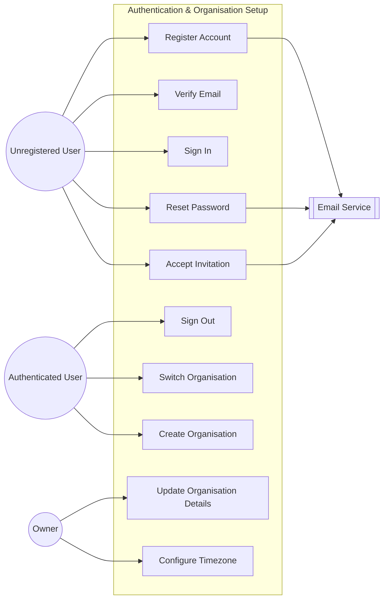

---

## 2. Employee Management

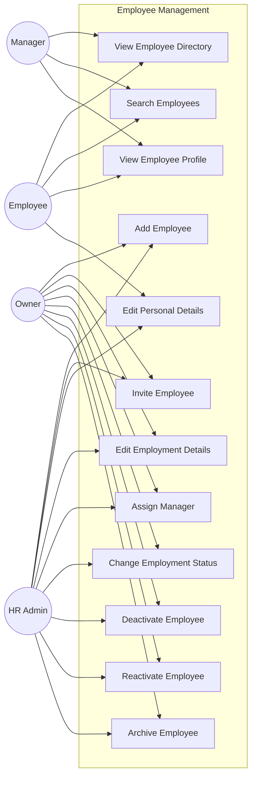

---

## 3. Leave Management

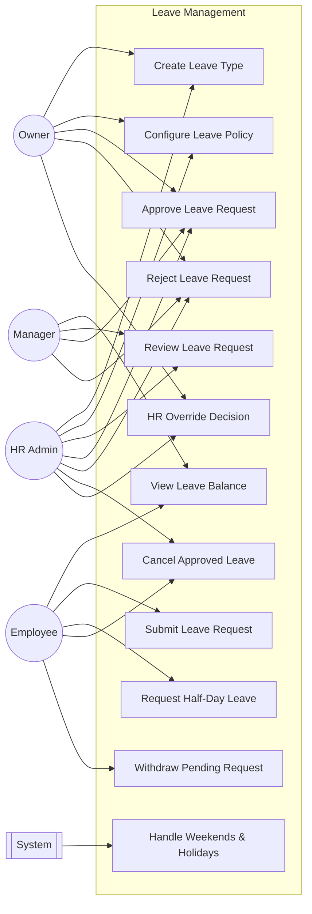

---

## 4. Attendance

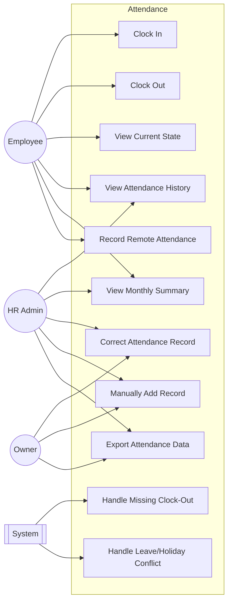

---

## 5. Onboarding

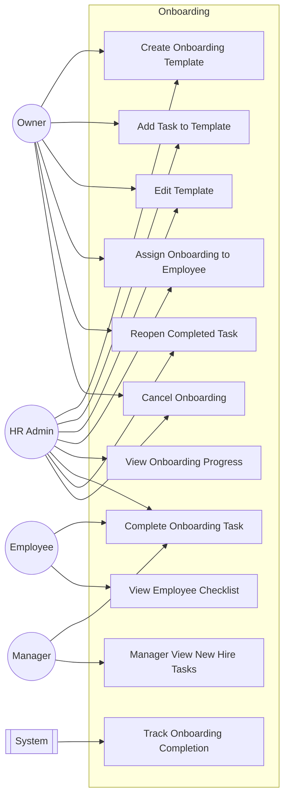

---

## 6. Documents

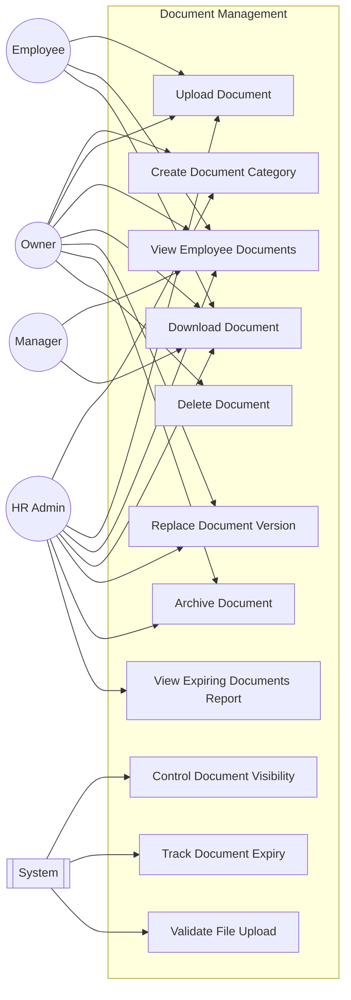

---

## 7. Payroll

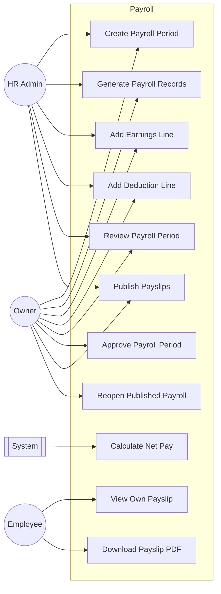

---

## 8. Notifications & Audit

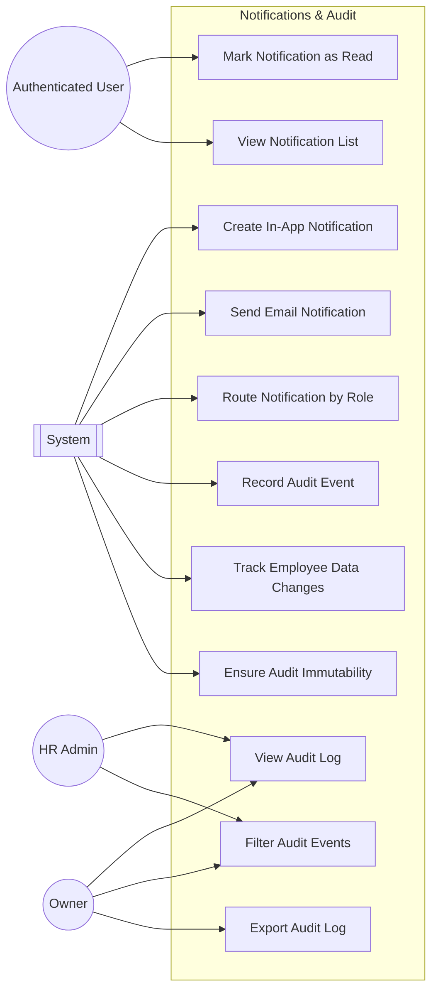

---

## 9. Employee Self-Service

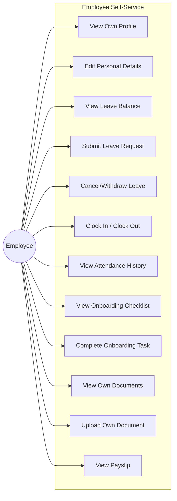

---

## 10. Manager Workflows

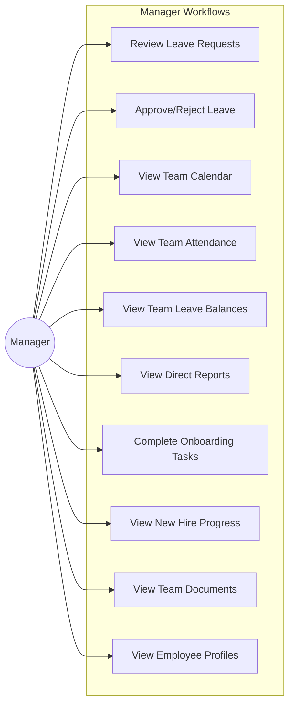

---

## 11. HR Administrator Workflows

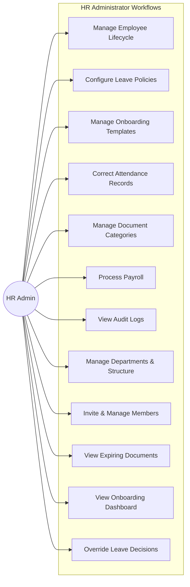

---

## Actor Legend

| Actor | Description |
|-------|-------------|
| Unregistered User | Person without an account attempting to register or accept invitation |
| Authenticated User | Any signed-in user regardless of role |
| Owner | Organisation owner with full administrative control |
| HR Admin | Human resources administrator managing day-to-day HR operations |
| Manager | Team lead with approval authority over direct reports |
| Employee | Standard employee using self-service features |
| System | Automated processes, scheduled jobs, and internal enforcement |
| Email Service | External email delivery supporting notifications and invitations |
