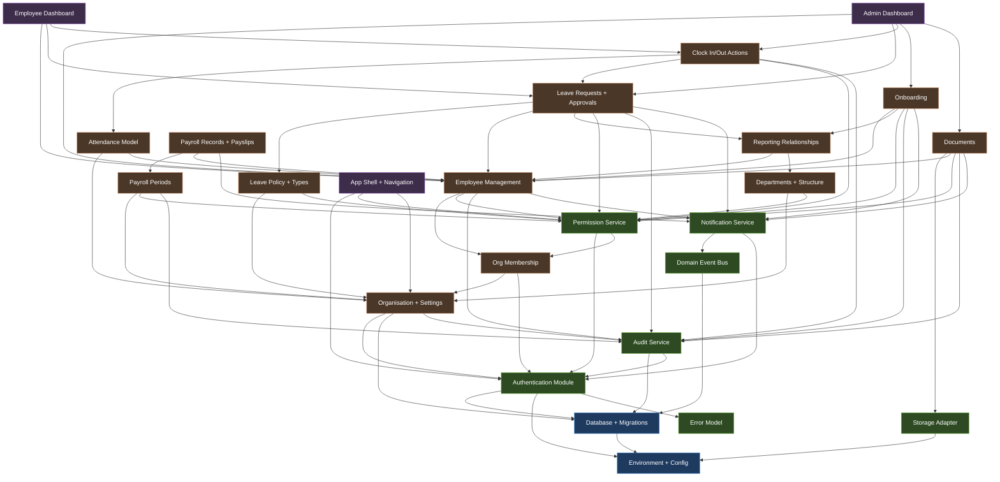

# Implementation Dependency Map

This document defines the dependency graph between HR Daddy V1 modules, identifies the critical path, parallelisable work streams, and high-risk dependencies.

---

## Dependency Graph



---

## Simplified Dependency Summary

| Upstream Module | Downstream Dependents |
|---|---|
| Authentication | Protected Routes, Org Membership, Permission Service, all domain modules |
| Organisation + Membership | Employee Management, Leave Policy, Attendance Model, Payroll Period |
| Permission Service | All feature modules (every mutation and sensitive read) |
| Employee Management | Leave, Attendance, Onboarding, Documents, Payroll |
| Departments | Reporting Relationships, Employee filtering, Dashboard reporting |
| Leave Policy + Types | Leave Requests, Attendance (blocks clock-in on leave days) |
| Attendance Model | Clock In/Out Actions, Dashboard metrics |
| Storage Adapter | Document upload/download, Organisation branding |
| Payroll Period | Payroll Records, Payslip publication |
| Domain Event Bus | Notification consumers, Audit consumers, Cross-module side effects |
| Reporting Relationships | Leave approval routing, Manager dashboard, Onboarding task ownership |

---

## Critical Path

The critical path represents the longest chain of sequential dependencies that determines the minimum time to deliver a working vertical slice:

```
Environment + Config
  → Database + Migrations
    → Authentication (register, login, session)
      → Organisation (create, settings)
        → Membership (invite, roles)
          → Permission Service
            → Employee Management (create, directory, profile)
              → Leave Policy + Requests (submit, approve)
                → Admin Dashboard (metrics)
```

**Critical path length:** 9 sequential stages

**Implication:** No shortcuts. Foundation infrastructure must be solid before feature development begins. Skipping steps (e.g., implementing leave without proper permissions) creates rework.

---

## Parallelisable Work Streams

Once the foundation (Auth + Org + Membership + Permissions + Employee) is complete, the following work streams can proceed in parallel:

### Stream A: Leave Management
- Leave types and policies
- Leave balance allocation
- Leave request submission
- Approval workflow
- Team calendar
- Working day calculator

### Stream B: Attendance
- Attendance model and schema
- Clock in/out actions
- History and monthly views
- Missing clock-out detection
- Corrections workflow

### Stream C: Onboarding
- Template CRUD
- Template instantiation
- Task assignment and completion
- Overdue tracking
- Cancellation on employee deactivation

### Stream D: Documents
- Storage adapter implementation
- Document categories
- Upload/download
- Expiry tracking
- Visibility permissions

### Stream E: Payroll
- Payroll period lifecycle
- Record generation
- Line item management
- Approval workflow
- Payslip publication

### Stream F: UI Shell + Dashboards
- Application shell and navigation
- Role-based menu rendering
- Admin dashboard widgets
- Employee self-service dashboard

### Parallelism constraints:
- Streams A-E can run concurrently after M1 (Foundation + Auth + Org + Employee)
- Stream A (Leave) should complete before Stream B (Attendance) validates leave-day blocking
- Stream F depends on at least one domain module being functional for meaningful dashboard metrics
- Notifications and Audit are cross-cutting and should be integrated into each stream rather than built as a separate stream

---

## High-Risk Dependencies

| Dependency | Risk | Mitigation |
|---|---|---|
| **Permission Service → All Features** | If permission model is wrong, every module needs rework | Design permission keys early; build integration tests from day one; use middleware pattern |
| **Tenant Isolation → Every Query** | Single missed org_id scope causes data leakage | Repository base class enforces scoping; automated cross-tenant tests in CI |
| **Domain Events → Notifications + Audit** | Synchronous event bus can create cascading failures | Notification failures must not fail the originating transaction (fire-and-forget for notif) |
| **Leave ↔ Attendance cross-reference** | Approved leave must block clock-in; attendance on leave day creates conflict | Define clear API boundary between modules; integration tests covering both directions |
| **Employee Deactivation Cascade** | Deactivation must cancel leave, close attendance, cancel onboarding atomically | Single transaction with explicit cascade handler; comprehensive test suite |
| **Storage Adapter → Documents** | File system vs S3 abstraction may leak implementation details | Define interface early with contract tests; test both implementations |
| **Payroll Decimal Precision** | Floating point errors in monetary calculations | Use integer cents storage and Decimal.js for calculation from day one; never use `number` for money |
| **Reporting Relationships → Approval Routing** | Circular reference detection, manager absence fallback to HR | Graph cycle detection algorithm; integration tests for edge cases |
| **Session/Auth → Everything** | Auth bugs block all development and testing | Build auth first with thorough tests; provide test helpers for other modules |

---

## Migration Dependencies

| Migration | Must Exist Before |
|---|---|
| Users table | Authentication module |
| Organisations table | Organisation module |
| Organisation Settings table | Leave/Attendance/Payroll configuration |
| Memberships table | Permission resolution |
| Employees table | All employee-dependent modules |
| Departments, Job Titles, Locations | Employee assignment |
| Reporting Relationships | Leave approval routing |
| Leave Types, Policies, Balances | Leave request submission |
| Attendance Records | Clock actions |
| Onboarding Templates + Tasks | Onboarding assignment |
| Document Categories + Documents | Document upload |
| Payroll Periods + Records + Line Items | Payroll management |
| Notifications table | Notification delivery |
| Audit Log table | Audit recording |

---

## External Service Dependencies

| Service | Module | Required For | V1 Strategy |
|---|---|---|---|
| PostgreSQL | All | Data persistence | Docker Compose with health check |
| SMTP / Email API | Notifications, Invitations | Email delivery | Optional in development (log-to-console fallback) |
| Object Storage (S3/Local) | Documents, Branding | File storage | Local filesystem default; S3 optional via env |
| Reverse Proxy (Caddy) | Deployment | TLS termination | Docker Compose service |

---

## Dependency Resolution Order

The recommended build order that respects all dependencies:

1. **Environment + Config** (no deps)
2. **Database + Migrations** (depends on: env)
3. **Error Model** (no deps)
4. **Authentication** (depends on: db, env, errors)
5. **Organisation** (depends on: auth, db)
6. **Membership** (depends on: org, auth)
7. **Permission Service** (depends on: auth, membership)
8. **Audit Service** (depends on: db, auth)
9. **Domain Event Bus** (depends on: db)
10. **Notification Service** (depends on: events, auth)
11. **Storage Adapter** (depends on: env)
12. **Employee Management** (depends on: membership, perm, audit, notif)
13. **Departments + Structure** (depends on: org, perm)
14. **Reporting Relationships** (depends on: emp, dept)
15. **Leave Policy** (depends on: org, perm)
16. **Leave Requests** (depends on: leave policy, emp, report, perm, audit, notif)
17. **Attendance Model** (depends on: org, emp)
18. **Clock Actions** (depends on: att model, leave, perm, audit)
19. **Onboarding** (depends on: emp, report, perm, audit, notif)
20. **Documents** (depends on: storage, emp, perm, audit, notif)
21. **Payroll Periods** (depends on: org, perm, audit)
22. **Payroll Records** (depends on: pay periods, emp, notif)
23. **App Shell + Dashboards** (depends on: auth, perm, org, domain modules)
